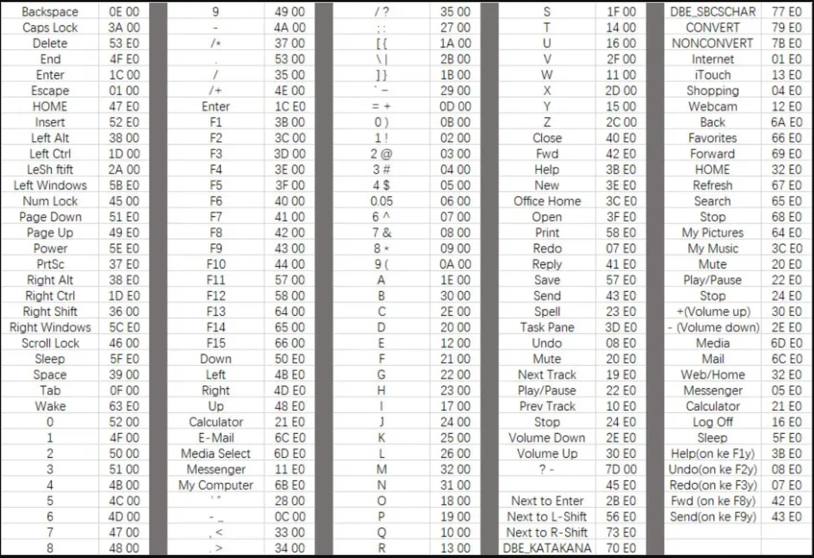

#! https://zhuanlan.zhihu.com/p/595740838

# 1. windows caplock和ctrl键位互换
>【github项目】 https://github.com/xiewendan/game-dev-doc/tree/master

# 2. 问题

键盘ctrl键位非常反人类，CapLock用处不大，打算把CapLock和ctrl互换位置一下

# 3. 思路

# 4. 解决方案

## 4.1. 使用
* 更改
  新建一个文本文件，命名为caplock_leftctrl_switch.reg，将如下内容复制进去，双击执行即可
  ~~~
  Windows Registry Editor Version 5.00
  [HKEY_LOCAL_MACHINE\SYSTEM\CurrentControlSet\Control\Keyboard Layout]
  "Scancode Map"=hex:00,00,00,00,00,00,00,00,03,00,00,00,1d,00,3a,00,3a,00,1d,00,00,00,00,00
  ~~~

* 取消
  cancel_switch.reg，将如下内容复制进去，双击执行
  ~~~
  Windows Registry Editor Version 5.00
  [HKEY_LOCAL_MACHINE\SYSTEM\ControlSet\Control\Keyboard Layout]
  "Scancode Map"=-
  ~~~

## 4.2. 原理

在windows中通过在注册表中添加Scancode Map项来达到键盘映射的目的，Scancode Map项位于注册表的[HKEY_LOCAL_MACHINE\SYSTEM\ControlSet\Control\Keyboard Layout]中（默认是不存在的）固定格式如下：

~~~
hex:[填充八个 00] [映射项数] [填充3个 00] [映射后ScanCode 原ScanCode] [填充4个00]
~~~

* 映射项数：02表示只映射一组，03表示映射两组，以此类推

* 映射后Scancode 原Scancode：CapLock的Scancode为3A 00，而Left ctrl为1D 00，将CapLock替换为left ctrl：3A 00 1D 00，将left ctrl替换为CapLock是：1D 00 3A 00

* 替换代码是：
  ~~~
  00,00,00,00,00,00,00,00,03,00,00,00,3A,00,1D,00,1D,00,3A,00,00,00,00,00
  ~~~

## 4.3. 练习

将F9和F10映射为音乐的开始暂停即Play Stop键。他们的code分别是
| 按键 | Scancode |
| :-----| ----: |
| F9 | 43 00 |
| F10 | 44 00 |
| Play | 22 E0 |
| Stop | 24 E0|

修改结果如下

~~~

"Scancode Map"=hex:00,00,00,00,00,00,00,00,03,00,00,00,43,00,22,E0,44,00,24,E0,00,00,00,00
~~~

## 4.4. Scancode码

# 5. 参考文献

[1] https://www.jianshu.com/p/852f69ad41a9