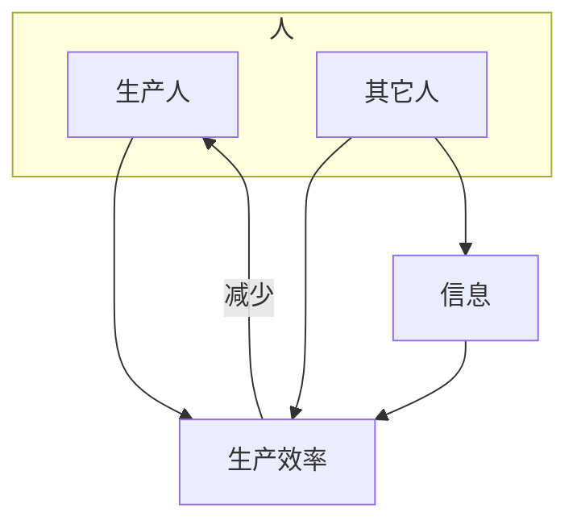
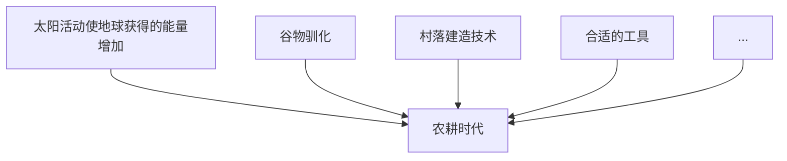
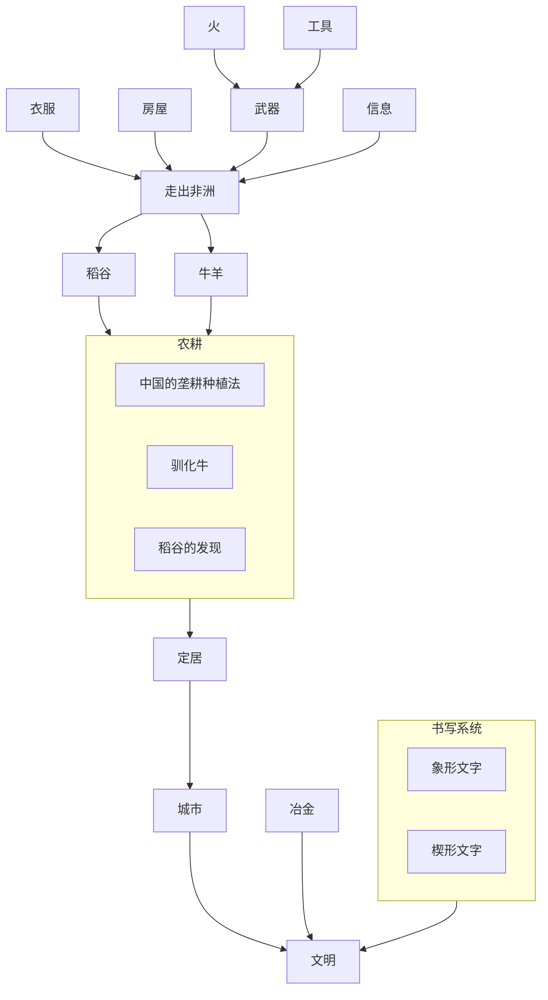
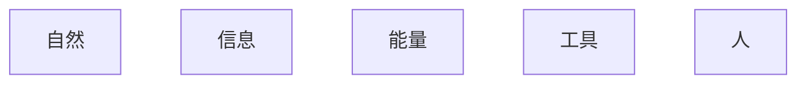
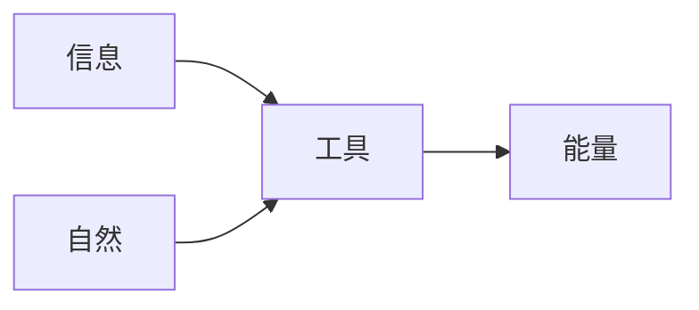
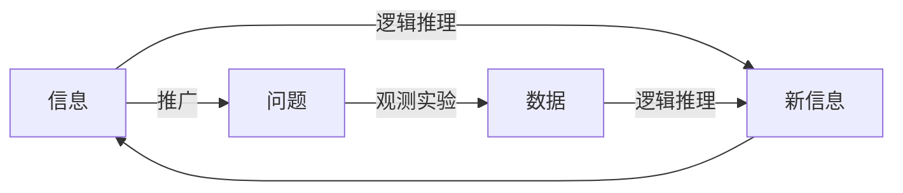
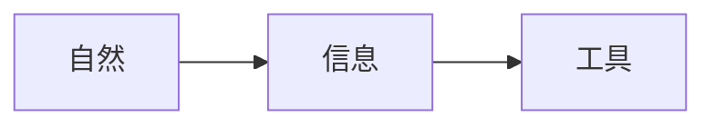
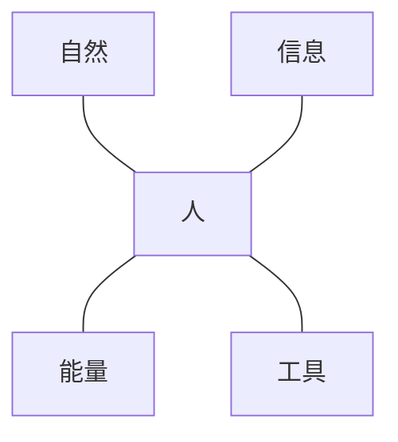

[TOC]

# 1. 一切都是能量和信息

## 1.1. 发刊词

* 信息和能量两条线

* 培养能力
  * 了解科技发展的来龙去脉，找到**共通的规律**，更好的把握未来
  * 解决问题的能力
    * 学习他人的能力：对于自己没做过的事情，**如何学习别人的经验**
    * 自我创造的能力：对于从来没有人做过的事情，**如何拆解复杂问题**，**把未知变已知**
  * 分清偶然性和必然性的能力

## 1.2. 人类是什么时候发明衣服的？

* **信息的相关性**是我们解决未知问题的重要工具。

* 能量的发展两个方向：一个是获得更多的能量，一个是节流

* 需求和发明的关系。真正有用的，长期存在的发明，它一定能解决实际问题，具有很强的需求。

## 1.3. 能量：文明的标尺和钥匙

* 取火技术的发明让人类掌握远高于自身的能量。人类获得的能量大于生存所需的能量，就可以用剩余的能量改变世界，改变世界的过程，让人类可以更好的利用能量，开启能量的正循环，人类文明启动

* 从**能量总量**可以很好的解释人类从狩猎采集转向农耕文明

* **任何事情最终做好，需要一个正反馈机制**。**好的生意要是能不断盈利的**。一种文明是否有生命力，就看它是否能形成正反馈。一个人是否有出息，就看**他做的每一件事情，是否能够成为放大自己进步的台阶**

* 一个文明能够利用的总能量，决定了文明的高度。今天像瑞士这样的国家，尽管可以发达，但它没办法像中国和美国，做出绝对水平很高的成就，主要就是能量总量不足。**凡是效率是需要的，总量也是需要的**

* 系统研究一门学问，需要有一个清晰的，容易理解和量化度量的线索，对于科技的发展，能量就是这样的线索。对于生活或者工作，我们不妨也给自己定一个这样的线索

## 1.4. 信息：如何贯穿人类文明？

* 信息，其实就是调动、指挥这些能量的要诀

* 将很多人组织起来做事情，沟通能力很重要，做不到这一点，就无法管理一个上万人的企业，更无法治理一个上亿人口的国家。因此，**我们怎样花精力锻炼自己的沟通能力都不为过**

* 如果我们不能从先辈那里学习有益的经验，而是**凡是都靠自己试错、摸索，我们的进步无疑会比同龄人慢很多。**

* 书写系统和文字是不同的，**书写系统**可以让科技完成**叠加**式进步

* 信息是贯穿整个文明的主线，信息传播越通畅的文明，发展越快

## 1.5. 总结



# 2. 自然时代--人类文明的启动

## 2.1. 你比原始人更懂得借助外力吗？

* 学会制造和使用工具，提高能量获取的效率（石器时代）。

* 学会使用火，在捕食之外获得能量

* 火的利用，是人在使用能量上的第一次巨大飞跃

* **最好的投资是投到自己的事业上**

* **君子生非异也，善假于物也**

## 2.2. 走出非洲，做世界的主人

* 人类走出非洲，使得人类可以接触全世界各种物种（包括谷物等可食的植物，牛马狗等可用的动物），并利用它们发展自己。

* 完成这一步需要很多技术上的先决条件，这些先决的技术，我们称之为预先要求，那些从先前技术中发展出来的新技术，我们称为依赖技术

    ```mermaid
    flowchart TD;

    subgraph 能量
    石器工具
    火的使用
    武器
    衣服
    搭建住所
    end
    subgraph 信息
    语言
    end

    石器工具 & 火的使用-->武器
    衣服 & 搭建住所 & 武器 & 语言-->走出非洲
    ```

* **先决条件**：走出非洲需要很多先决条件，**任何技术发明或者重大事件的出现，都需要满足先决条件，这就是时机**

## 2.3. 文明的曙光：农耕是怎么开始的？

* **滞后效应**就是要改变原先的状态，通常不是立竿见影，效果总是滞后的

* 走进农耕时代是迟早的事，太阳活动知识加速了进程而已。如果**必然性**是目的地，那么**偶然性**就是变速器

* 理解**预先要求**。我们学习不仅要了解每一个知识点，还需要了解它们的预先要求和自然结果，这样，知识才能形成知识体系



## 2.4. 文明的标志：文明是怎么开启的？
* 定居开启了人类文明

* 产生文明的三大特征
  * 有文字记载（即有书写系统）
  * 修建城市（定居）
  * 使用金属器

*  从黏土到陶器，经历了几十万年，从0到1往往比我们想象的难的多

## 2.5. 能量的密度：为什么要在城市生活？

* 足够的**人口密度**，带来三个好处
  * 能够让一部分人从事农业以外的事情（带来了分工，分工进一步提高效率）
  * 能够养活一部分僧侣和知识阶层，能够养活专职的城市管理者和执法者
  * 有足够的力量抵御外部的威胁
* 美索不达米亚文明、古希腊文明，属于商业文明或者海洋文明；古代埃及、古代印度、古代中国属于农耕文明或内陆文明
  * 商业文明带来两个发明：一个是轮子+畜力，一个是风能
  * 地理环境决定了早起文明中心不同的特点，那些拥有大片良田的文明中心，有可能集中人力和物力建造金字塔和长城。而没有大片耕地的文明，更可能发展出商业文明

## 2.6. 冶金：一场三千年前的技术碾压

* **冶金技术既是文明发展的结果，本身也促进文明的发展**。他的产生要求能量的利用水平达到相当的高度，也反过来让人类更有效的利用能量

* 冶炼一件金属和冶炼成批金属，背后的能力是不同的。**商业的价值，往往在于打造从1到100的大规模量产系统**

## 2.7. 农业科技：中华文明为什么领先？

* 中国采用了垄耕种植法，并采用牛具（深耕犁）和马具，获得更多的能量，中国文明得以领先世界。

* 一个文明的影响范围有多大，取决于它能有效运送货物的终点有多远

* 从运输的能量效率说明水路运输的重要性

## 2.8. 瓷器：中国历史上最伟大的发明

* 发明的本质不在于是否第一个发现了现象，而在于找到一套行之有效的方法、确定性的方法，保证成功率

* 瓷器的四大特点：发明难、用途特别大、经济意义大、难以替代

* **人最大的价值也在于他的不可取代之处**

* 中国瓷器太发达，影响了玻璃产业的发展。凡是有一利，就有一弊

## 2.9. 金字塔：为什么不是外星人建的？

* 正确理解金字塔是谁造的这件事，其实是一个试金石，能够测试出一个人的认知水平，思考的方法以及是否有解决问题的能力

* **人类最了不起的地方，就是好奇心，而且愿意琢磨事情，把不懂的问题搞懂，这就是我们面对未知应该有的态度**

* 在金融上，市场永远是正确的，如果理论和市场不一致了，不是市场错了，而是理论错了。**在生活中，事实是正确的，如果理论解释不了现实，不要觉得事实错了，而是要更正我们的理论**。对于金字塔，它的存在是事实。不能因为它的存在否认人类的问题，而是需要通过它，了解当时的文明水平

* 通过介绍大金字塔，进一步理解能量和文明的关系，体会到了为什么只有中央集权的农耕文明才能完成这样的伟大工程

* 要想驳倒对方不切实际的想法，我们需要提出自己合理的想法。科学家在解释大金字塔建造之谜的问题上不是和阴谋论者吵架，而是通过研究，给出合理的解释。

## 2.10. 古埃及象形文字是如何破解 & 楔形文字是如何破解的

* 文字破译最根本的是利用对一件事情多种文字同时记录是所产生的冗余度，找到信息之间的关系，即信息的相关性
* **记录**是保证科学发展能够取得**叠加式进步**的条件，也是**职业人士做事的方法**

## 2.11. 小结



# 3. 徘徊时代：抽象科学的诞生
** 为什么其他文明没有诞生古希腊的科学
* **科学**是源自古希腊，建立在严格的**逻辑推理**之上，后来在近代西方**科学方法基础**上发展起来的，可以**证实和证伪**的**完整体系**。

* 泰勒斯用观察和思考解释世界，毕达哥拉斯提出要在数学中通过逻辑证明命题的正确性，亚里士多德奠定了基于观察和实验的自然科学的基础，阿基米德数学与物理的结合，同时将科学应用于工程。

* **科学是系统**的，是**在逻辑的基础上不断递进**的，而不是各种知识点的简单结合。因此，我们**学习是需要系统的，这样才能获得可叠加式的进步**。

* 本章解决了信息源的问题

## 3.1. 为什么造纸术的发明比纸的发明重要

* 人类文明的进步不仅取决于科技发明本身，还取决于这些发明的传承和传播

* **记录和传播知识，重要性不亚于创造知识本身**

* 蔡伦发明的是一个具体的东西，而是一套量产的工艺

* **造纸术：蔡伦发明的不是纸，而是一套工艺。偶然的成功不重要，找到一种通向成功的方法更重要**。

## 3.2. 印刷术：信息复制的革命
* **信息复制技术技术沿着速度越来越快，成本越来越低，准确率越来越高的方向发展**

* **发明一种新东西，重要性远不如发明一种能够成功复制的工艺流程**。这是古腾宝和毕昇的区别。成功的复制流程，才能产生更大的影响力

* **印刷术：衡量发明贡献大小的标准，不是时间的早晚，而是产生影响的大小。和首先提出想法的人比，最后把事情做成的人更可贵**

## 3.3. 阿拉伯文明：一个被低估的文明

* **同行审查制度**，使得失败的尝试在将来能够避免，成功的经验可以推广，从而加快科技进步的速度
* 阿拉伯文明科技繁荣的一个重要原因是它地处欧亚大陆，商业和信息的交流便利。
* 阿拉伯文明：学问虽远在中国，亦当求之

## 3.4. 大学：中世纪开出的最美的花
* 科学的发展需要一个相对独立，不为生计发愁的知识阶层
* 好奇心是科技发展的原动力
* 牛津大学：系统学习的重要性，实验科学的重要性

## 3.5. 文艺复兴：本质上是一场科技复兴
* 文艺复兴，本质是科技复兴，科技复兴就是对希腊、罗马文明的复兴
* 文艺复兴在佛罗伦萨的必然性和偶然性。

## 3.6. 复盘：各个文明到的竞争，比的是什么

* 科技进步的必要条件是能量总量，充分条件是能量密度

* 信息传递的有效性，取决于两方面：信息传递的载体（语言，文字，书写系统），第二个是信息传递的方式（一对一，一对多，单向，双向）

* 谁想到不重要，谁做成才重要

* 科学的诞生不在于提供更多的零散知识点，在于提供一套系统的方法，使得后人能够在前人的基础上不断发展科学，得到更多的知识，获得叠加式收益

# 4. 启蒙时代：用系统眼光观察世界

## 4.1. 哥白尼、布鲁诺、伽利略，到底是谁确立了日心说

* 伽利略确立了科学研究的重要方法：实验和观测。

* 我们通过伽利略使用望远镜这件事情，强调了善用工具的重要性

* 伽利略、第谷和开普勒的成就，从本质上讲，靠的是比别人拥有更多的信息。从这个角度上讲，日心说的胜利可以说是信息的胜利

* 科学成就的确立，需要证据，而不是雄辩

## 4.2. 现在医学：如何从非科学到科学

* 笛卡尔总结科学的方法
  * 先提出**问题**，但不要有预先设定的结论
  * 进行**实验**
  * 从实验中得出**结论**和解释；这一点很重要，结论是实验得到的，而不是头脑里固有的
  * 将结论**推广**并且普遍化
  * 在实践中找出**新的问题，如此循环往复**

* 科学研究是通过正确的的证据（和前提条件），进行正确的推理，得到正确的结论的过程。

* 近代科学和古希腊科学有一定的继承性，体现在**理性推理**上。又有巨大的不同，体现在强调实验的重要性，特别是进行**精确可重复性实验**。

* 科学的方法可以让我们更容易接近真理。在这个方法中，假设、逻辑推理、实验，都是收集和验证信息的过程，非常重要

* 在没有验证之前，不要急于先下结论，心态要开发，这是笛卡尔说的**大胆假设**；在论证的过程中，做事情要严谨，要有逻辑，这就是**小心求证**

* 科学不是一个结论，是一个求真的过程，随着它的结论被推广，大家就会发现新的问题，在解决新问题的过程中，科学就进步了

* 流程图
  ```mermaid
  flowchart LR;


  问题--实验和观测-->记录数据-->信息--逻辑推理-->理论--推广-->问题
  ```

  * 实验要求精确可重复
  * 推理要符合逻辑，要严密


## 4.3. 牛顿“牛”在哪里

* 建立一个学科体系，首要的任务是定义清楚各种基本的概念
  * 牛顿定义了经典物理学中的这些基本概念，然后在此基础上，才提出了力学三大定律，进而搭建起整个物理学的大厦

* 机械论认为我们的世界是客观物质的，是确定的，是可以认识的。物质世界的变化，我们看到的各种现象都可以用各种机械运动来描述，而人类则可以通过对世界的研究，发现那些运动背后确定的规律。**世界是可认知的。**

## 4.4. 现代化学：如何从炼金术演化而来？

* 磷的发现，标志着从炼金术到化学的第一个转折，因为不同的人用类似的方法得到相同的结果，从此让一个新物质的发明过程变得可以验证
* 拉瓦锡的科学研究方法
  * 理性批判：不接受任何自己不清楚的真理。对一个命题要根据自己的判断，确定有无可疑之处，任何可疑之处的命题都不会是真理
  * 化繁为简，化整为零：对于复杂的问题，尽量分解为多个简单的小问题来研究，一个一个的分开解决
  * 先易后难：在解决上述小问题时，应该按照先易后难的次序，逐步解决
  * 归纳综合：解决每个小问题后，再综合起来。看看是否彻底解决了原来的问题。

* 可验证性、可重复性是判定科学和非科学的标志之一
* 构建一个知识体系，首先要定义概念，确定独立，我们今天在做事情的时候，常常先要把考核标准制定好。
* 在科学上，定量实验和定量分析非常关键，在今天的工作中，没有数据和信息，就不能随意下结论

## 4.5. 欧洲炼金术如何再发明瓷器？

* 欧洲人对瓷器烧制的原理有理性的认识，并有定量的了解

* **系统的做实验**，**完整地进行记录**，也保证了科技取得**可叠加式**的进步

* **艺术**和**技术**的结合，才是产品最高的境界

* 技术本身具有流动性，很难通过封锁将技术锁住

* 利益的驱动可以带来技术的发展

# 5. 机械时代：用科学方法推动

## 5.1. 工业革命（一）：工业革命的本质

* 如何透过现象看本质？省略一切不重要的细节，将关注度放到一头一尾作对比

## 5.2. 工业革命（二）：为什么是瓦特

* 在瓦特之前，工匠们往往是**靠经验的积累**来改进一种产品或者技术，而瓦特是直接通过**科学原理**找到现有产品中的技术缺陷，然后又通过**科学分析**，找到解决问题的答案。这就让**科学**和**技术**紧密的结合起来了

* 瓦特的成功不仅仅是技术的胜利，更重要的是他在思维方式的胜利

## 5.3. 工业革命（三）：月光社和工业革命

* 人最大的幸运在于处在一个适合自己的**时代**。瓦特的幸运在于，他生对了国家，生对了时代，而且恰好周围有一大批人帮助他完成上述工作

* 我们将大环境的重要性，**制度**比人更重要

* 学术团体对科技进步的作用是巨大的，瓦特的成功在很大程度上受益于月光社（我们应该从圈子中借力）


## 5.4. 工业革命（四）：工业革命中谁受益？

* 受益者
  * 工业革命中掌握核心技术的发明家（瓦特、富尔顿等）
  * 将原有产业和蒸汽机结合的企业主（利用新技术的人）
* 失败者
  * 被大机器产业挤垮的小企业（没有利用新技术的企业主）
  * 对技术一直半解的妄念者（追求永动机的人）
  * 过度恐慌者（反对蒸汽机的人）

* 如何站在浪潮之巅
  * 利用新技术，改造原有产业，整个时代就站在你这一边

## 5.5. 工业革命（五）: 机械时代的管理特点

* 思维特点：确定性、可拆解性和标准化

* 效率优先：优化流程（流水线管理）和标准化管理

* 同构的树状组织结构

* 可预测性

## 5.6. 为什么是焦耳证实了能量守恒定律

* 判定专业科学家和民间业余科学家的方法：他们的工作方法是否科学

* 焦耳有他人没有的测量温度的设备。先进的工具对科学发明非常重要。当今世界，大公司拥有的计算设备和数据都是很多大学所不具备的。

* 圈子和环境真的很重要。焦耳在被皇家学会接纳后，他的合作者水平都很高，他后半生做出了很多高水平的研究成就。这侧面反映了好大学、好单位、高水平的圈子和优秀朋友的重要性

* 能量守恒：人类第一次知道能量是怎么回事，焦耳给大家划定了一条边界，让大家在边界内做事，同时给大家指明了方向。

## 5.7. 发现电的本质

* 电的本质：从偶然发现中总结出必然规律，成功才可以被复制。

## 5.8. 如果可以选择，你想成为爱迪生还是特斯拉

* 首先创立了企业研究实验室的爱迪生就是把科技和商业紧密结合的第一人

* 要用科学的方法做事，否则只能得到偶人的发现和低水平的重复

* 对于有一技之长的人，成为特斯拉反而现实一些，毕竟，具备商业头脑的人比较稀少。**清楚自己专长和弱项的人就会划定一个做事的边界，不去做越界的事情**。

* 不要为了标新立异而故意唱反调，事实永远是我们发表评论的基础

* 爱迪生与特斯拉：商业头脑其实很难培养，对于大多数人来说，做好一个专业人士要容易的多。

## 5.9. 什么人受益于第二次工业革命

* 受益者：掌握核心技术的人、了解（现有产业+电=新产业）企业家、金融资本家

* 金融资本：资本家投入到新技术、新产业中很少的钱，不断的被放大。因为他们提供的不仅仅是资本，还包括对未来商业的前瞻性。

## 5.10. 信息的获取和细胞学说

* 细胞学说的发现，说明先进工具（显微镜）和科学方法论的重要性

* 细胞学说：要了解一个整体，需要先将它分解成部分单独进行研究，然后再从对局部的认识上升到对总体的认识，这就是认识论上的分析和综合。

## 5.11. 通信如何改变世界？

* 通信的本质有两个：第一个是将信息进行编码，第二个是有效进行传输。

* 电报：世界上永远不缺乏从0到1的发明，缺乏的是能够走完全程的人。

## 5.12. 到底是谁发明了汽车

* 汽车发明之争：同一发明背后同时出现多位发明人，那一定是时代的必然性

* 对发明来讲，更有意义的是看他们对后来的影响，而不是谁更早

* 生产线的本质是以机械能量替代人身体的能量，这和用计算机处理信息取代人脑处理信息相似。

## 5.13. 人类如何进入飞行时代的？

* 莱特兄弟：做事情要规范化、系统话，要有理论依据，不要过分信赖自己有限的经验和直觉。

* 实现飞机的三个预先要求：空气动力学、轻质量大功率的发动机和高能量密度的燃料，控制系统。凯利、奥托、莱特兄弟分别解决了这是三个问题。

* 科学的工作方法很重要。我们要学习莱特兄弟的工作方法。

* 人工智能领域：鸟飞派指从经验出发，让计算机模拟人的思维方式，试图获得智能的做法，这个做法证明行不通。空气动力学派，指搞清楚智能问题的本质，让计算机通过数据和数据模型解决智能问题。

## 5.14. 机关枪：杀伤力的跃进

* 人类进入热兵器时代，本质其实是对能量远距离传送的需要

* 如果没有一个牢固的**科学体系**，技术很难取得进步，原有技术也很难受益于时代进步的成果

* 弓箭不仅在能量使用上效率不高，而且它无法受益于近代的机械和化学方面的科技进步，而那些进步却很容易让火枪受益。**我们在选择做一件事情时，一定要选择那些能够受益于时代进步的事情做**。

* 东西方的科学发展路径不同，因此最终的科技成果大相径庭。**核心是没有牢固的科学体系**

## 5.15. 进化论：我们从哪里来？

* 进化论的贡献是首先找到了生物之间的联系，其次，也是更重要的贡献，是帮助人们开启了一双天眼，人们第一次开始采用动态的眼光看待生命的发展。

* 进化论是一场开天辟地的科学革命，它告诉我们从哪里来，但却不会告诉我们往哪里去。

* 过度繁殖，生存竞争，物竞天择，适者生存

## 5.16. 历次革命如何用到当下

* 人工智能时代，第一学会和他们合作，第二，关注问题，结合最近的技术看看能不能把过去的老问题改掉

* 投资人的基本素质之一：不怕错失机会，不后悔

# 6. 量子时代

## 6.1. 危机就是机会：物理学危机之后

* 当大多数人只能理解生活中看到的那些现象时，掌握了**逻辑**的人就在见识上比别人走的更远

* 物理学危机：如果没有19世界末的物理学危机，就不会有爱因斯坦等人开创现代物理学。危机出现，总有一些人会把**危机看成机会**

## 6.2. 上帝掷骰子吗？

* 我们的宇宙是不连续的，而且存在很大的不确定性

* 测不准：光的粒子性和波动性，是它的不同维度。我们通常只看到事物的一个侧面，就以为那就是全貌。只有站在更高的认识维度，才能看起全貌

## 6.3. 科技助产士：战争所带来的科技奇迹

* 战争是技术的助产士，其**核心是能量总量和能量密度聚焦**，让产品更容易落地。

* 雷达：战争是技术的助产士，而用于战争的技术，后来几乎无一例外地用于了民用。

## 6.4. 原子弹：德国为什么没有成功？

* 调动能量的水平太差。今天的科研，除了聪明的大脑，一流的物质条件必不可少

* 做事情的目的一定要明确。

## 6.5. 阿司匹林：制药业的革命

* 药物常规的研制方法：先确定天然物，提取出有效药物成分，确定有效成分的结构，合成具有有效成分结构的其它化合物且副作用较小，得到药物。

* 只有把药物的机理搞清楚，找到有效成分，利用它制作出副作用较小的药品，才有实际意义。

## 6.6. 青霉素：发明不是从0到1

* 青霉素：发明是从0到N的全过程，从0到1固然了不起，但是能走到N的才是英雄。

* 调动资源的能力对重大发明至关重要。

## 6.7. 信息时代的科学基础和方法论

* 控制论：利用对各种输入信号的反馈来控制系统。（底层逻辑是不确定性）

  聪明人考虑的都是如何根据反馈做出调整，适应现状，而不是预测未来。

* 信息论：对于一个你一无所知的黑盒子，要想了解里面的状态，就需要信息。

* 系统论：整体的性能未必能通过局部性能的优化而实现。


# 7. 智能时代

## 7.1. 计算机的本质：重新理解摩尔定律和信息时代

* 计算机：IT发展的方向，一直都是提高单位能耗的计算能力。计算的本质，就是信息的控制下，利用能量实现运算。

## 7.2. 遗传学：如何把生物问题，变成信息问题？

* DNA双螺旋：为什么是沃森发现了DNA双螺旋结构模型？因为与其从观察结果去抽出理论，不如从假设出发，寻找证据论证。

* 身信息遗传复制的难题，看起来是个生物学问题，但其本质还是个信息问题。如何消除不确定性？最关键的就是利用更多的数据和先进的工具掌握更多的信息

## 7.3. 基因工程：人工合成胰岛素和转基因

* 从人工合成胰岛素开始，人们启动掌握甚至改变我们自己的命运的历程。

* 基因工程：农业的增产，得益于破解了植物的DNA信息。但是，人类对基因的了解其实还是很少，需要格外谨慎，一旦犯下任何错误都会是灾难性的。

## 7.4. 太空竞赛：为什么苏联无法完成登月任务？

* 阿波罗登月：任何大型项目的比拼，都是人才的比拼。为什么苏联在太空竞赛中输了？因为苏联和整个西方世界的智力进行比拼。

* 直到今天，想登月的大型项目，依然是比拼一个国家能够调动的总能量

* 登月项目，也体现了信息论、控制论、系统论的科学方法的重要性。

## 7.5. 互联网诞生：互联网的本质是什么？

* 从互联网的诞生看，互联网的本质是以信息换能量。

* 很多技术，在它无法完全盈利的时候，要靠政府扶持，一旦盈利，政府应该退出，让市场机制发挥作用。

## 7.6. 移动互联网：前赴后继的移动通信之路

* 移动互联网的本质，从某种角度上讲也是信息换能量，而且是以一种更有效的方式。

* 移动互联网：移动互联网的成熟，需要满足四个技术的预先要求，而每一个技术的突破，站在浪潮之巅的领导者都会更换一次。

## 7.7. loT：万物互联到底是什么意思？

* 第一代互联网本质上讲是计算机和计算机的联网。第二代互联网是人和人的相连。第三代是万物互联。

* 万物互联：每一代互联网比上一代，从设备数量和市场规模，都会有巨大的增长，这是未来的机会所在。

* 从能量角度讲，每一代互联网都是以更少的能量传输和处理更多的信息，这一点是未来发展的方向。

## 7.8. 大复盘：用科学方法论指导我们的行动

* 科学是一种对世界的态度，是逻辑世界的观点，和日常做事的方法，不代表正确，也不限于特定的知识和结论。

* 逻辑对科学发展的重要性，从事实出发，讲究逻辑，得到合理的结论，这就是我们应该遵从的做事方法。

* 集中力量办大事。做减法，少做事就是这个道理

* 控制论，信息论，系统论。

## 7.9. 其它
* 癌症治疗：今天无人能够预测人体内基因可能的突变，只能在它发生后迅速采用有效的治疗措施。轻预测，重反应，是我们在信息时代，应对不确定性的通用思维方法。

* 基因编辑：编辑人类的事情迟早会发生，但是我们还没有充分准备，改错比改对影响要大很多，其结果有太多的不确定性。

* 核聚变：人类已知了最强大能量，但可惜还无法有效利用。科学家为此无怨无悔的投入，因为在正确的道路上前进，终究是会抵达的。

* 量子加密：从理论上讲，无法破译的加密方式就是一次性加密，这利用了不确定性原理，给加密通信带来了一种新的选择。


* 信息：
  信息在我们这个宇宙诞生的时候就客观存在
  信息的第二个来源是时间对万物变化的记录
  信息的第三个来源是利用现有信息和知识推导出的新知

# 8. 总结

## 8.1. 几要素


* 自然：天然存在的各种物质，各种自然存在的规律

* 信息：包括已知的知识、科学体系、科学的方法和规律等等

* 能量：是能够被我们所利用的用于生产生活

* 工具：包括火、石器、基因技术、原子弹、计算机等等

* 人：从事生产的人和从事研究的人。生产的人与能量的获取直接相关；从事研究的人，通过获得各种信息，转为工具，提高获取能量的效率。

## 8.2. 能量



* 生存是人的原动力和根本目标。能量让人更好的生存。

* 借助工具，人可以获得更多的能量

* 借助工具，人可以利用更少的能量达到目的

## 8.3. 信息



* 可重复定量的实验，让获得的数据更准确，逻辑推理让信息更有效

* 信息是产生可叠加式发展的基础

* 信息在各个过程中，科学指导，让人们更科学的做事

* 利用工具，人们可以观测到更多的数据，是获得更多信息的基础。

* 利用工具，人们可以记录传播信息，让更多人获得信息，然后产生更多的信息。


## 8.4. 工具


* 信息（科学技术）落到实处，就是工具

* **君子生非异也，善假于物也**

## 8.5. 人



* 人所有要素的核心

* 好的制度保证了人的利益，提升主观能动性

* 人是所有转变的原动力。没有人，所有的都是孤立的

* 信息、能量、工具，都需要被人所知才能被人所利用。因此信息的传播非常重要，信息传播的目的是让人可以更好的获得他所需要的信息。

* 科学的方法是人在实施这些转变的过程中，需要符合逻辑。信息到数据，需要有严格的可重复的实验为基础；数据推导出信息，需要有严谨的推理。这样获得信息，才能被后人所利用。后人才能站在巨人的肩膀上，进一步往前进。

## 8.6. 所有转变的公共点

* 所有转变都需要能量作为动力

* 所有转变都是人推动的

* 所有转变因为工具更容易

* 所有的转变都依赖信息作为指导

* 更多的能量总量、更高的能量密度、更多的人、更多的信息都集中到某一个特定的转变过程，会极大加速这样的转变

* 所有的转变是具备先决条件的，所有先决条件都具备，这就是时机，要学会把握时机。


## 8.7. 指导转变的信息，即科学的方法

* 科学的解决一个问题的出发点
  * **`信息+人+工具+能量=解决问题`**
    * 获得足够的信息，即调研。调研该问题他人的解决方法，解决思路，遇到的问题，结论
    * 工具，是否有更好的工具，辅助自己解决问题，或利用获得更多的信息，或利用提高效率
    * 人，提升自己的思维能力，自己的能力是否已经足够来解决这些问题。
    * 能量，通常比较容易让人忽视，一些大型的项目，需要足够的能量，需要项目负责人能够获取能量

  * 当发现自己解决不了一个问题，应该从上述角度出发分析
    * 如果信息不足，收集更多的信息；当系统的输出不够，去增加更多的中间输出结果
    * 工具不好，去找更好的工具；当找不到工具，尝试自己去创造工具
    * 人的能力不足，需要去提升自己的能力，或是找牛逼的人来解决
    * 能量不足，第一争取获得更多的能量，第二，尝试减少能量的需求。

* 科学的方法是让信息能量获取，具备可叠加式的
  * **科学是系统**的，是**在逻辑的基础上不断递进**的，而不是各种知识点的简单结合。因此，我们**学习是需要系统的，这样才能获得可叠加式的进步**。
  * 信息的记录、传播、主动利用信息，是让科学产生可叠加式发展的基础

* 科学方法：控制论、信息论、系统论

## 8.8. 价值观

* **人类最了不起的地方，就是好奇心，而且愿意琢磨事情，把不懂的问题搞懂，这就是我们面对未知应该有的态度**
* **人最大的价值也在于他的不可取代之处**
* **商业的价值，往往在于打造从1到100的大规模量产系统**
* **任何事情最终做好，需要一个正反馈机制**。**好的生意要是能不断盈利的**。一种文明是否有生命力，就看它是否能形成正反馈。一个人是否有出息，就看**他做的每一件事情，是否能够成为放大自己进步的台阶**，**最好的投资是投到自己的事业上**
* **艺术**和**技术**的结合，才是产品最高的境界