# 1. ! <https://zhuanlan.zhihu.com/p/599058008>

# 2. 头文件包含问题
>
>【github项目】 <https://github.com/xiewendan/game-dev-doc/tree/master>

* 在编译过程，发现重定义，因为include是通常是嵌套的，最后只是报了重定义，但不知道自己的代码是哪里include导致的，本文将利用编译过程中生成的预处理文件，帮你定位到include有问题的地方

# 3. 解决过程

* 找到报错的信息

  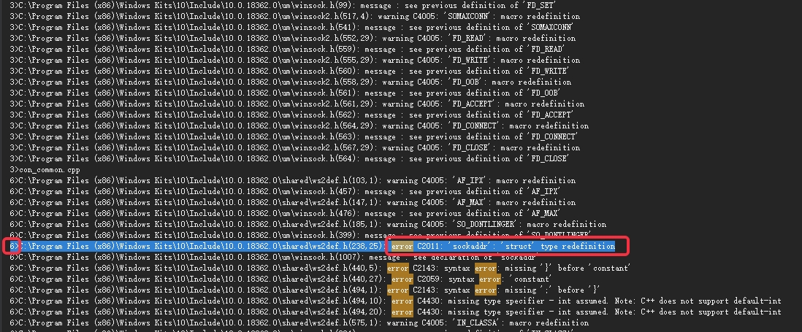

* 双击报错，找到对应的代码

  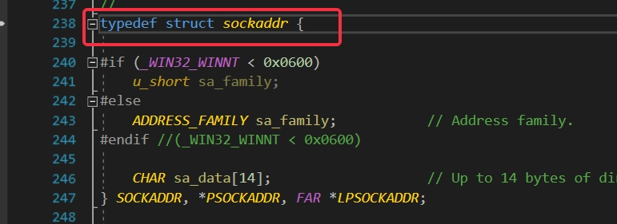

* 找到编译哪个cpp文件导致重定义问题

  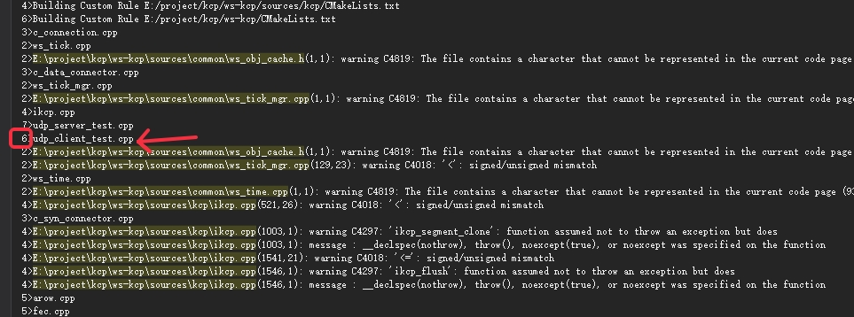

* 将cpp文件所在的工程，设置为输出预处理文件

  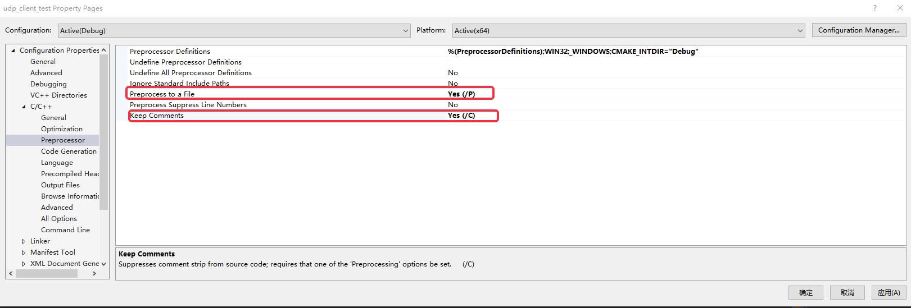

* 找到预处理文件，第一处定义，和它的头文件包含关系

  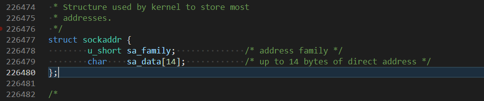

  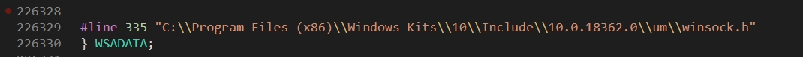

  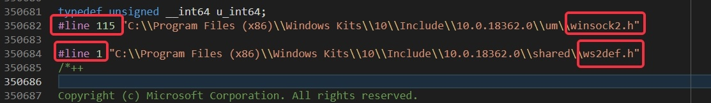

  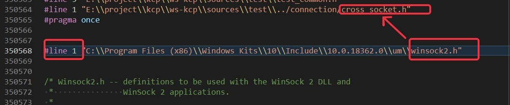

* 找到第二处定义，和它的头文件包含关系

  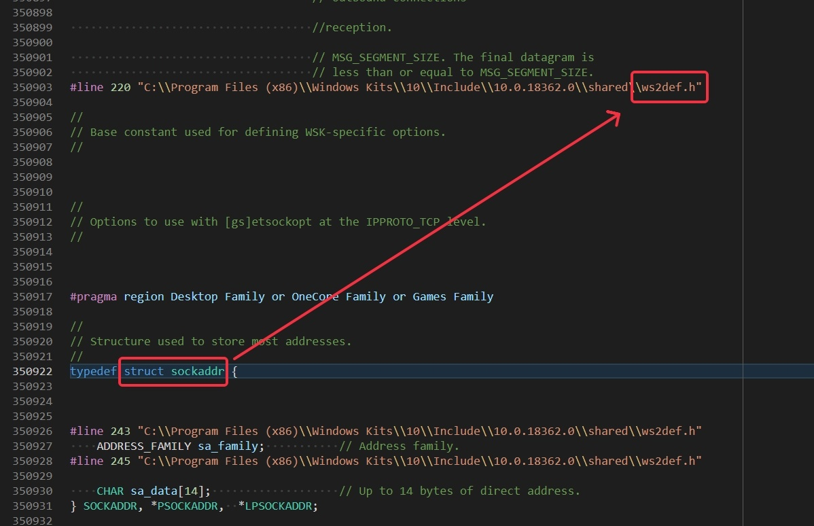

  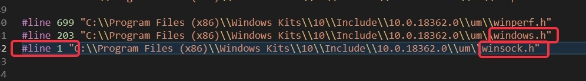

  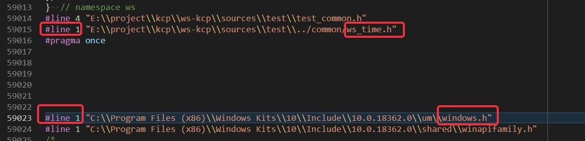

* 因此，cross_socket.h中包含winsock2.h和ws_time.h包含windows.h（里面包含winsock.h文件）最终导致冲突

# 4. 前置知识点

## 4.1. 编译output通道

visual studio并行编译，输出output里面最前面的数字表示通道，通道相同是同一个编译过程

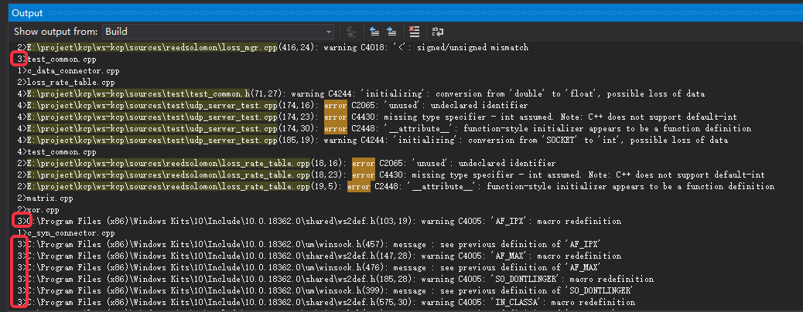

> 3对应的输出是一个编译过程

## 4.2. 编译过程

* 完整的编译过程是

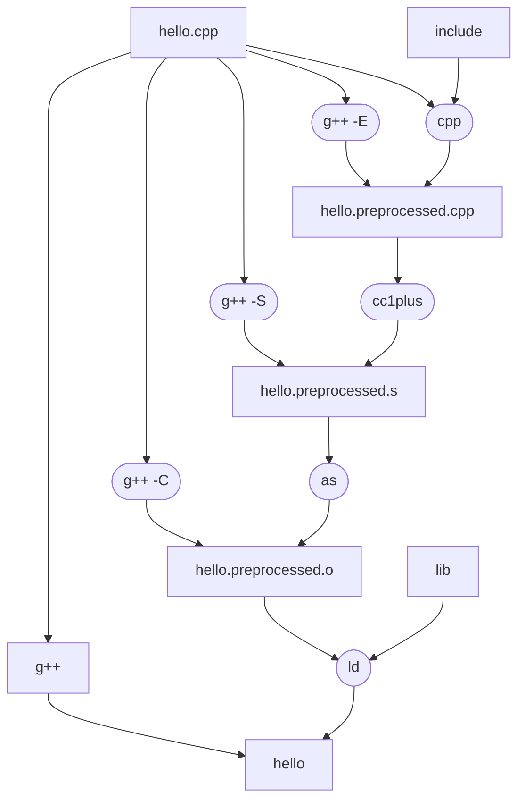

* 其中第一步预处理得到的结果，可以用文本文件直接打开查看, 参考[编译链接](https://github.com/xiewendan/game-dev-doc/blob/master/2022/%E7%BC%96%E8%AF%91%E9%93%BE%E6%8E%A5/%E7%BC%96%E8%AF%91%E9%93%BE%E6%8E%A5.md)

* 得到的预处理结果，遇到头文件，递归展开，里面包含行号，因此，可以知道每个文件的包含过程。
