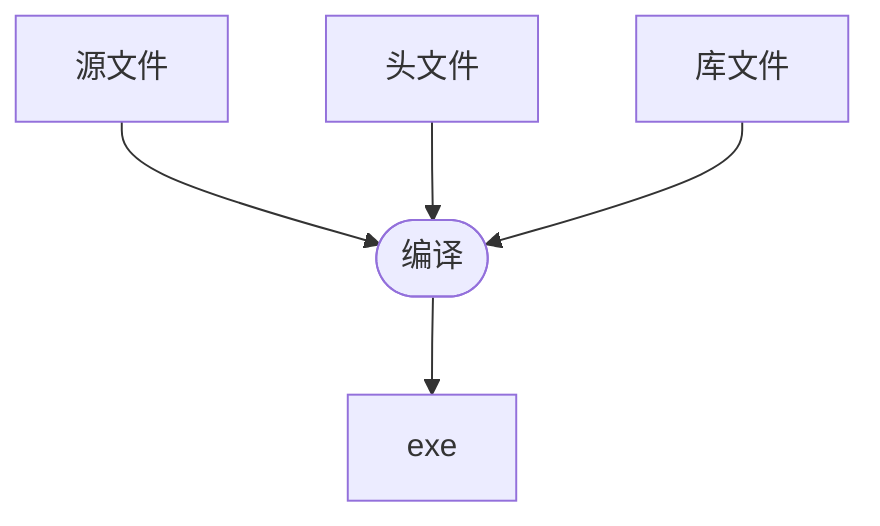
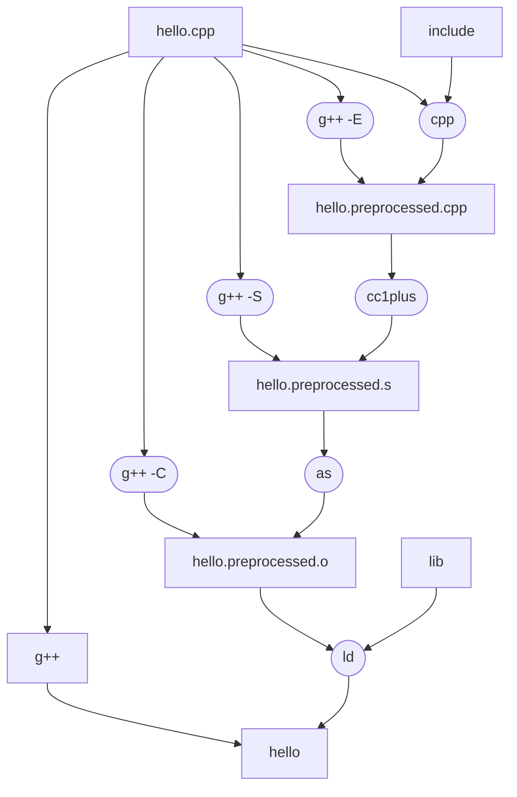
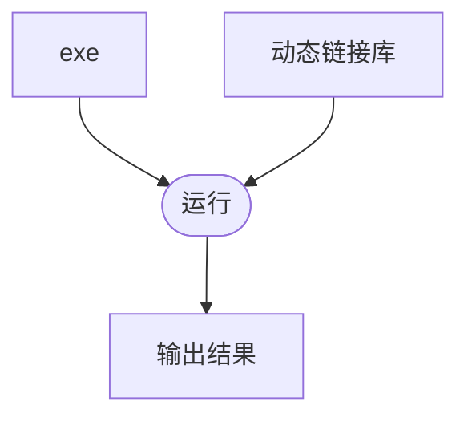

#! https://zhuanlan.zhihu.com/p/595740404
# 1. 程序编译链接

## 1.1. [TOC]
------------------------------------------------------------------------------

# 2. 问题

如何引入一个c++库，一直不是很清晰，特别是如何编译c++库，如果遇到问题，还不知道用什么工具来定位，本文梳理一下编译的流程

------------------------------------------------------------------------------

# 3. 思路

编译全流程，并且了解中间结果，同时知道怎么查看中间结果的值。

------------------------------------------------------------------------------

# 4. 解决方案

## 4.1. 编译

### 4.1.1. 输入输出

* 指定头文件：`g++ -I`
* 指定库：`g++ -L库目录 -l库文件名`

### 4.1.2. 过程

* cpp：预处理
  * 头文件，宏等的处理，主体是替换
  * 用文本文件打开查看结果
* cc1plus：编译
  * 生成汇编代码
  * 用文本文件打开查看结果
  > 命名混淆：针对c++的重载、命名空间等c没有的特性，命名需要混淆Mangling。你会看到_ZSt4endlIcSt11char_traitsIcEERSt13basic_ostreamIT_T0_ES6_ 这种奇怪的名字，可以用`c++filt`查看该函数的原始签名
  > `nm 库名 | c++filt` 可以还原所有的函数
* as：汇编
  * 生成二进制机器码
  * 先用`file`查看文件类型，发现是elf文件；用`readelf`查看文件；`nm`可以查看二进制文件中的符号
* ld：链接
  * 库和二进制机器码生成可执行文件
  * 先用`file`查看文件类型，发现是elf文件；用`readelf`查看文件；`nm`可以查看二进制文件中的符号

## 4.2. 运行

### 4.2.1. 输入输出

* LD_LIBRARY_PAtH：环境变量指定动态链接库的搜索目录

> `ldd`可以查看链接依赖，如果搜索路径设置错误，会爆对应库找不到
> LD_PRELOAD：预先加载动态库，可以用自己实现的malloc覆盖掉系统的malloc。

### 4.2.2. 过程

* 1 调用创建进程的系统函数
* 2 系统验证参数，打开指定的程序文件
* 3 解析程序二进制格式
* 4 根据程序提供的信息，进行必要的初始化
* 5 在内核中创建一个保存了进程信息的结构体
* 6 创建程序运行需要的虚拟内存映射、运行栈等
* 7 跳转到程序文件指定的入口，开始运行程序

------------------------------------------------------------------------------

# 5. 问题
* python的cffi加载dll或so，可以有一些报错提示，作为查问题的依据
  ~~~
  from cffi import FFI
  FFI().dlopen("so的完整路径")
  ~~~

# 6. 结论

------------------------------------------------------------------------------

# 7. 展望

------------------------------------------------------------------------------

# 8. 文献

