# 1. 用好pycharm编辑器

[TOC]

>【github项目】 https://github.com/xiewendan/game-dev-doc/tree/master

# 2. 问题

平时主要用python编写程序，用的最多的是pycharm编辑器。本文主要讨论亮点
* 如何用好pycharm编辑器来提升日常的开发效率？
* 日常使用问题记录

# 3. 解决方案

## 3.1. vim插件安装：ideavim
* vim插件是程序员非常喜欢的一个编辑器插件，编码过程中，可以尽量避免使用鼠标，利用键盘的快捷键实现代码行的切换，文本的复制，提升编码效率
> 注：个人上手vim的心得是，vim本身支持的功能非常多，如果要记住全部的命令都不太现实，会让直接放弃。通常把使用最高频的命令，如上下左右移动、查找、选中、复制、粘贴、删除，刻意练习一段时间就好了，未来根据需要在学更多的命令。

## 3.2. 模板：live template（代码模板，加快编码速度）

live template，翻译过来就是动态宏，可以自己定义一些宏，在敲出缩写，即可自动补全所有​
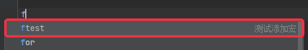​

### 3.2.1. 配置模板
* 配置方式一：利用现有模板

    * 导出配置，参考下图操作，得到settings.zip文件
        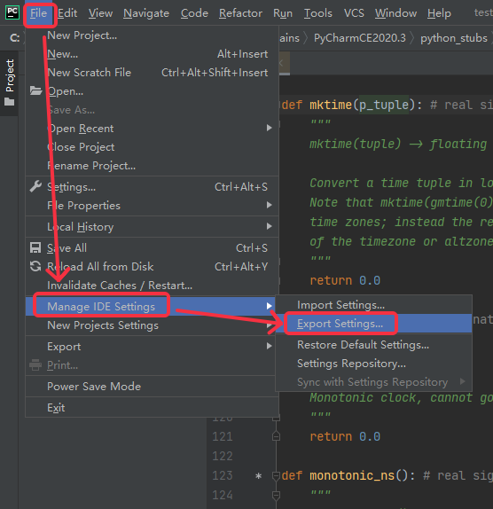
        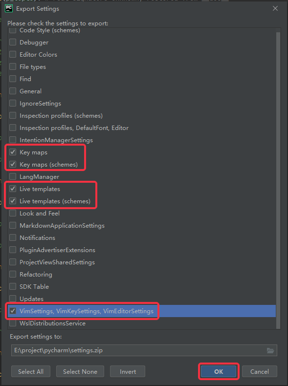
        
    * 导入配置，参考下图操作
        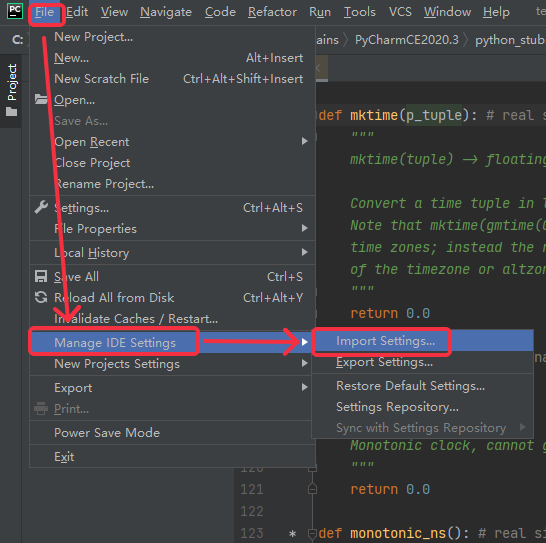
        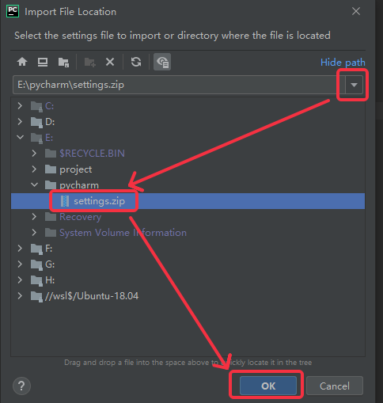
        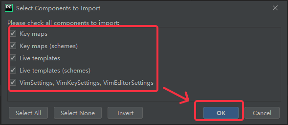

​
* 配置方式二：手动配置

    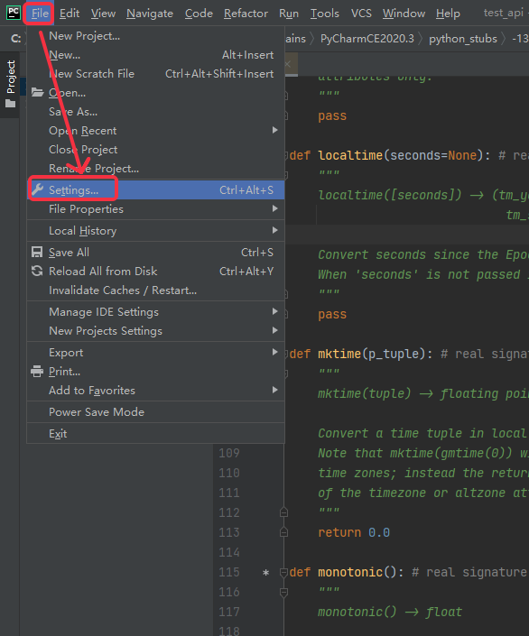
    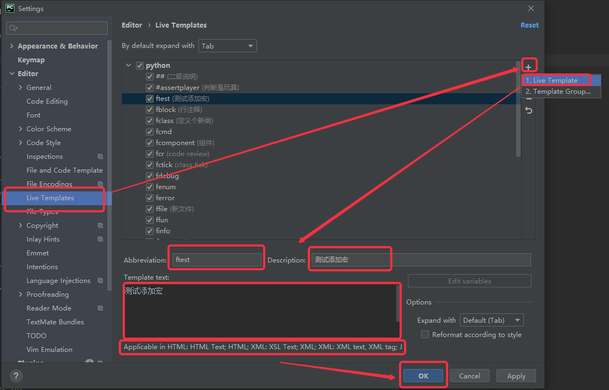
​

## 3.3. 快捷键：

常用的快捷键可以帮助我们快速编辑

* ctrl+ o：打开文件 （Main menu/Navigate/File...）
* ctrl + tab：上一次/本次编辑文件之间切换
* ctrl + j ：上一次编辑的位置（Main menu/Navigate/Back）
* ctrl + k ：下一次编辑的位置（Main menu/Navigate/Forward）
* ctrl + c：复制
* ctrl + v：黏贴
* ctrl + ; : 代码格式优化（Main menu/Code/Reformat Code）
* ctrl + p: 打开资源管理器（Other/Show in explore）
* ctrl + /：多行注释和取消注释（Main menu/Code/Comment with Line Comment）

### 3.3.1. 快捷键有时候配置不生效
在前面配置了vim，这时，快捷键会被vim抢了，因此，需要把快捷键修改为IDE模式

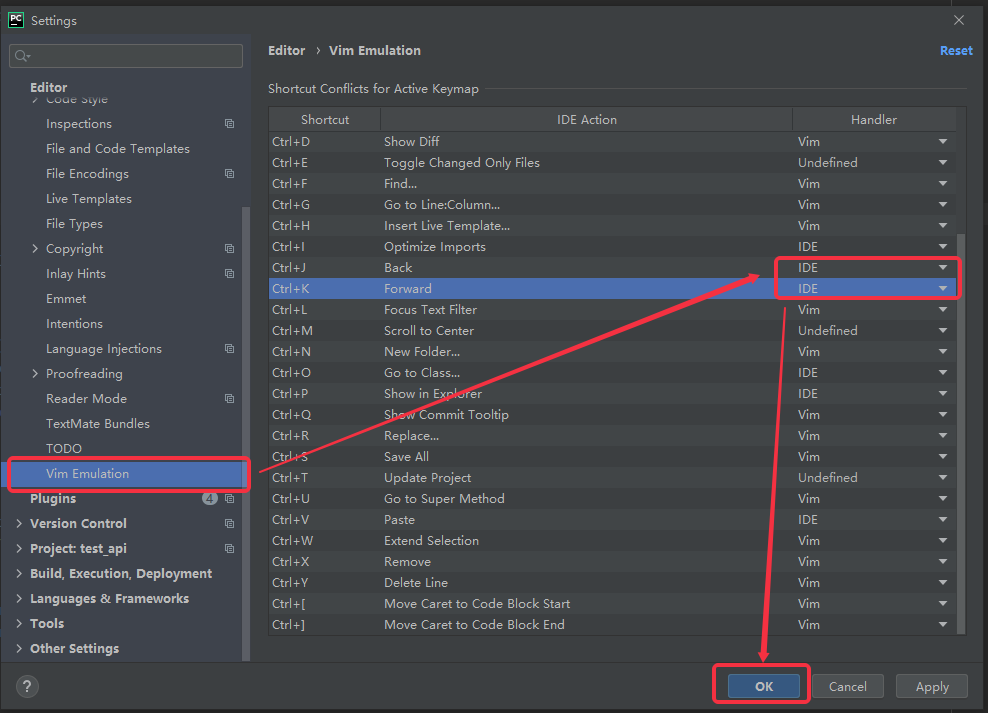
​

## 3.4. 自动补全
* 定义了class App，那么pycharm中敲：'app.'，会列出所有该类的函数和成员变量

  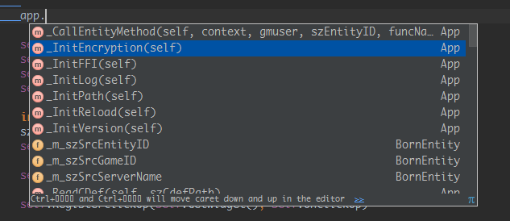

* 注释函数返回类型，调用函数后，会自动补全，如下：
  ~~~
    @property
    def ConfigLoader(self):
        """
        @rtype :conf.ConfigLoader
        """
        return self.m_configLoader
  ~~~

* ai自动补全 copilot，这个会上传代码到微软的服务器，因此，公司内部不要使用

## 3.5. 其它问题

### 3.5.1. 不自动优化
如果导入了一个模块，但在包内没有引用，在优化的时候，改import会被删除。为此，需要在不希望被忽略的包前加`# noinspection PyUnresolvedReferences`，如下：

~~~python
    # noinspection PyUnresolvedReferences
    import math
~~~

### 3.5.2. 格式化不生效

ctrl+alt+shift+L：可以打开格式化文件的配置窗口，如下：

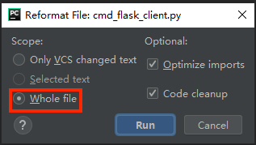

* whole file：格式化整个文件
* optimize import：优化导入
* Code cleanup：清理代码

### 3.5.3. project structure配置

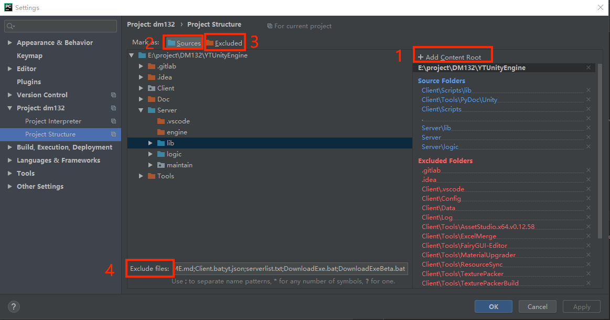

* 1、Add Content Root：添加指定目录作为项目的根目录，可以添加多个

* 2、Sources：选择指定的文件夹，可以将该目录设置为库目录，pycharm可以import该目录下的文件而不会报错

* 3、Excluded：排除目录，某些目录不希望添加到工程中，用这个来排除

* 4、Exclude files：排除文件，只需要指定明文件名。如Client\yt.json，只需要写yt.json即可

### 3.5.4. project interpreter配置

1. 打开setting，点设置按钮，选择add。
    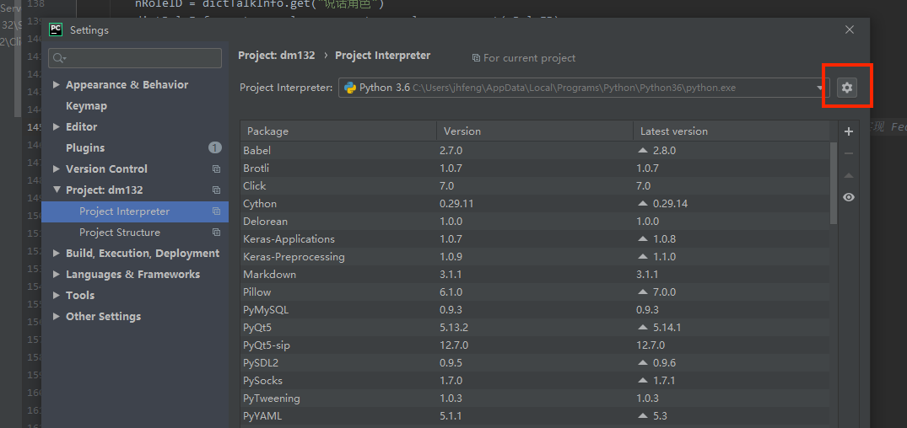

2. 把python3的安装路径手动设置到这里。（绿色框路径设置到红色框）
    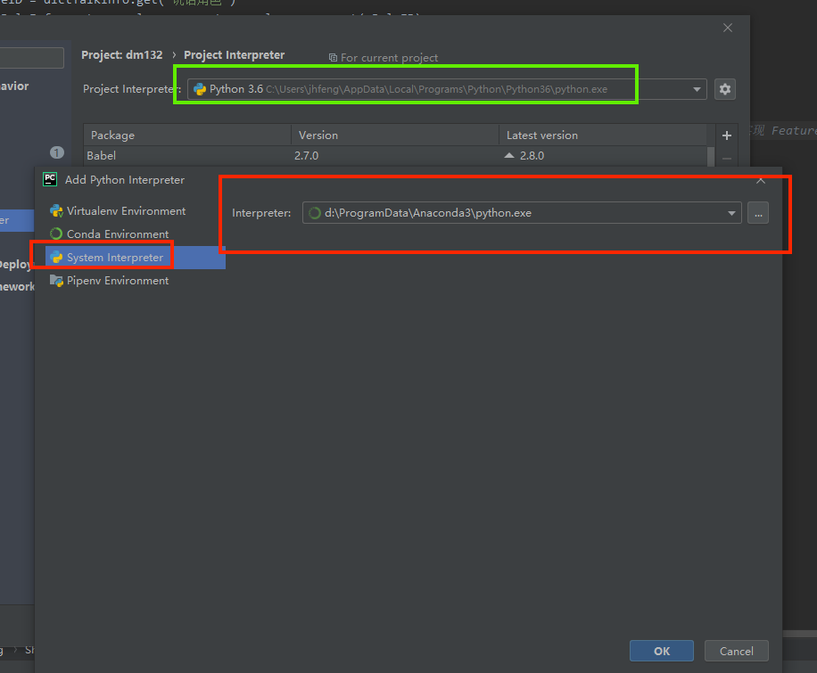

3. 回到setting界面，选择路径没有括号的一项。
    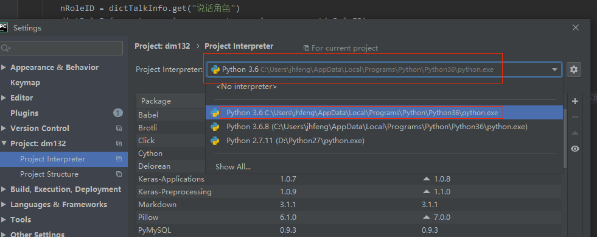

# 4. 结论

# 5. 展望

# 6. 文献

* [pycharm编辑器介绍](http://blog.csdn.net/u013088062/article/details/50100121)
​
* [pycharm编辑器配置](http://blog.csdn.net/pipisorry/article/details/39909057)
​
