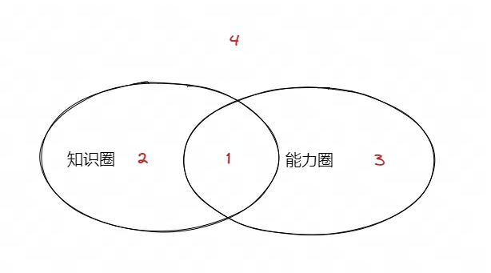
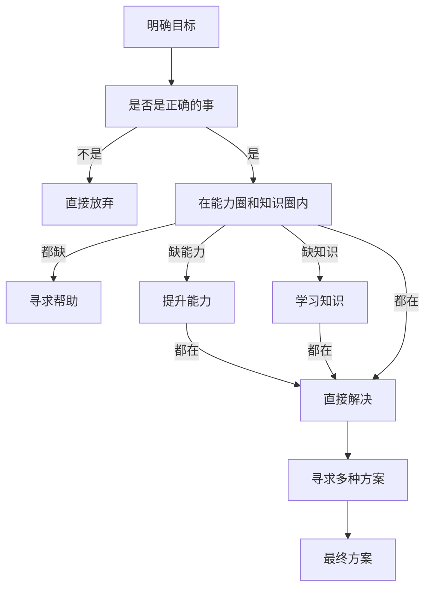
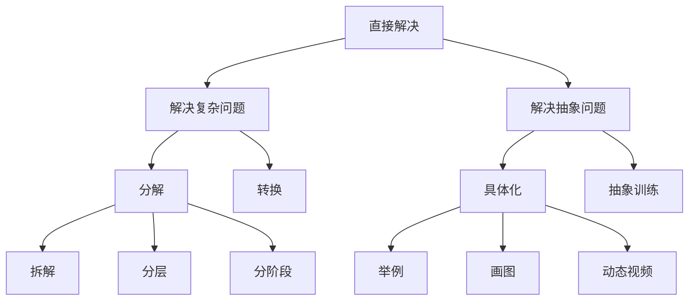

# 目标

*   借助项目，提升自己解决复杂问题的能力

# 选择研究方向

*   服务器端最复杂的问题是大世界项目，并且未来有可能会用上，为此，选定该方向作为研究方向

# 业务分析

*   梳理业务流程
    *   基于用户对象和应用场景梳理业务流程图
    *   业务流程图

*   方案框架式为业务流程服务，因此越熟悉业务流程，就能够设计出越好的框架

# 调研

## 查找资料

*   经典教材：找到基准线
*   高质量期刊：最新进展

用excel整理出所有找到的资料，包括年份信息、标题、要点、链接

> 相关资料，可以查看吴军的阅读与写作，还有科研过程中的方法论。参考链接\[1]

## 阅读资料

*   尽量阅读纸质资料（能够更专注、且更不易疲劳）

*   先阅读基准材料，然后按照年份相关性阅读

*   资料文章都有框架、模式，了解这些，可以快速知道要点

*   总结要点：记录，总结才知道自己是否读懂

## 综述

*   将所有相关资料的要点整理，得到综述文章，包含不同方案的优劣和创新点

# 方案设计

*   框架
    *   框架图：核心模块，及其之间的交互
    > 数据流图、流程图、序列图、状态图、框架图，常用的软件设计图，抽象问题具体化，可以让我们更清楚的想问题。

*   核心算法：数据结构和算法（让自己想清楚算法细节）

*   业务流程验证：结合业务分析得到的业务流程图，嵌套到当前的框架，验证框架是否能够满足业务流程

*   边界分析：考虑尽可能全的边界
    > 底层框架，考虑全的边界，避免后期出问题查问题的时间。待到应用的时候，出问题，查底层问题，会非常麻烦

# 代码实现

*   类图：从设计直接到代码，较为复杂，为了简化，增加类图设计，即设计-->类图-->代码，通过增加一个阶段简化复杂性
    > 框架分析和业务流程分析，设计类图，然后在用业务流程验证接口和成员设计是否合理

*   按照核心业务流程写代码：思路清晰

*   整理代码
    *   输入输出边界：assert
    *   必要的log：提供足够的log，方便查问题
    *   较好的可读性：好代码的第一标准
        *   目录、文件、类、接口（是否可以删除不必要的接口、接口是否清晰、const和引用）
    > 增加整理代码，避免在写代码的时候，分散注意力。
    > 将原本写代码拆分成三个阶段，类图、写代码、整理代码，简化写代码的难度
    > 除了，在写完代码进行整理代码，在其它时候，也可以做，整理代码也就是重构，时机：时时定时，当发现代码很丑的时候重构，定期进行一次重构

*   运行：初次运行，会爆各种错误，这是正常的。

*   解决bug
    *   保持平和的心态（这是解决问题的第一步，调整好心态）
    *   知识圈(获取信息)：
        *   基础知识
        *   log信息、coredump信息
        *   通过工具获取信息
        *   源码
            > 阅读源码也是一种解决问题的方法
    *   能力圈(科学的分析方法)：正向调试、逆向回溯
    > coding阶段的要求：恰当的assert、exception、error log。让引起错误原因的位置和显示错误的位置尽可能的接近，通常位置越远，查问题越难。

*   性能优化：profile定位，然后选择优化方法
    *   架构层：分布式架构、多线程多进程架构
    *   算法层：降频和优化算法、空间换时间
    *   语言层：编译语言、解释语言。编译选项、pgo编译
        *   编译语言：-O3编译选项、pgo编译优化、lto优化
        *   脚本语言：jit，转成编译语言
    *   系统层：windows、linux
    *   硬件层：选用好的硬件，将算法硬件化

# 测试

*   单元测试
    *   对数器
*   压测
*   上线测试
# 效果
# 整理文档和技术复盘
* 文档内容包括当前文档的各个条目
* 技术复盘
  * 每个阶段使用方法论调整，即更新到当前文档
  * 每个阶段的时间管理，即更新到当前文档
# 总结

## 零星点

*   解决复杂问题：将问题简化到能够解决的问题。简化的方法：
    *   分解
        *   拆解：横向分解，分解成不同的模块，可以不断细分
        *   分层：任何问题，都可以通过增加一层来解决
        *   分阶段：一个写代码的阶段，分解成三个阶段，每个阶段就会变得简单。在同一阶段处理太多事情，会让事情变得复杂，相反，会变得简单
    *   转换：找到等价信息，相关信息去将问题转换为我们能够解决的问题

*   解决抽象问题
    *   具体化（举例、画图、动态视频等）：画图（数据流图、类图、时序图、流程图、框架图、思维导图等）不同类型的图，可以辅助解决不同的问题，让我们把一些不清晰不明确的抽象的东西更具象化
    *   抽象问题可以训练和思考：抽象化的刻意练习，是抽离出常规的操作，加以应用训练。人们对于数字和它的各种运算，就是一种抽象化，并总结了一套常规操作，并让自己熟悉

*   向他人需求帮助

*   做正确的事比正确做事更重要

*   思考多种方法，想到更好的方法事半功倍

*   明确目标：才能明确重点，做事的方法，做事的原则

*   问题分类
    
    *   1 既在能力圈又在知识圈，是能轻松可以解决的问题
    *   2 在知识圈，不在能力圈：需要提升能力，思考欠缺什么样的能力，去补足
    *   3 在能力圈，不在知识圈：需要去学习缺乏的知识
    *   4 不在能力圈，也不在知识圈：通常需要需求他人帮助

## 图

> 对于简单的问题：凭直觉，o(1)
> 对于复杂的问题：才需要走上面的流程，o(n)

# 备忘

*   如何阅读源码
    *   核心流程中的核心代码

*   项目需求管理
    *   分清主次：有些就不是正确的事

## 参考文献

\[1] [阅读与写作](https://github.com/xiewendan/game-dev-doc/blob/master/2023/%E9%98%85%E8%AF%BB%E4%B8%8E%E5%86%99%E4%BD%9C/%E9%98%85%E8%AF%BB%E4%B8%8E%E5%86%99%E4%BD%9C.md)
