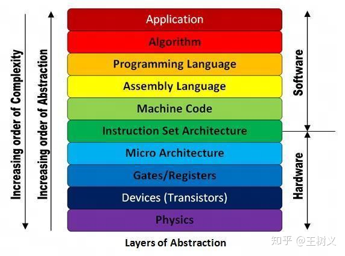
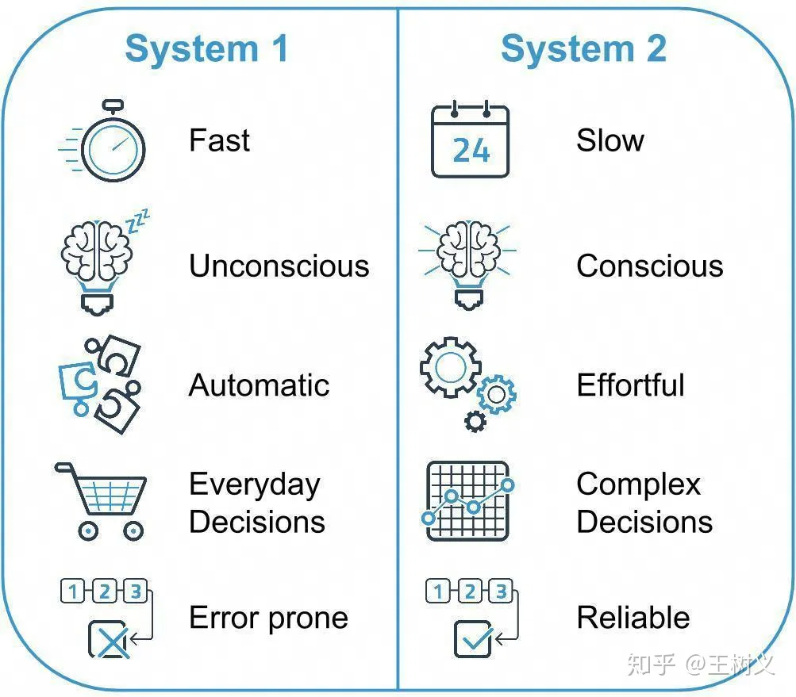
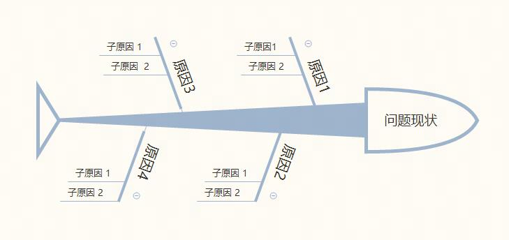
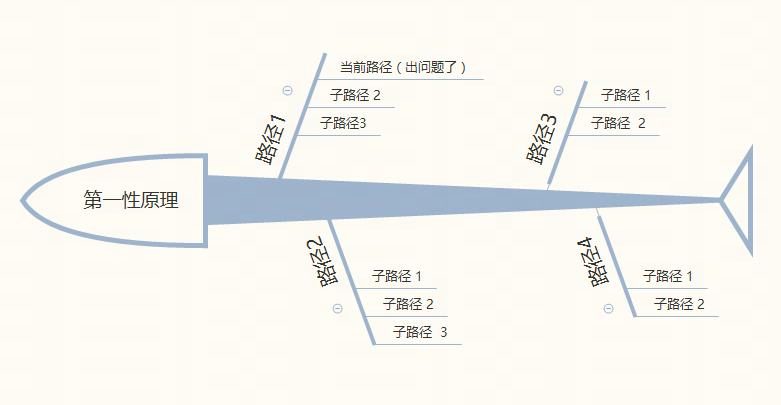
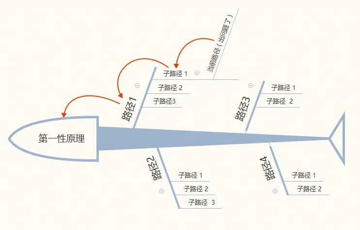

# 1. ! <https://zhuanlan.zhihu.com/p/637853157>

# 2. 第一性原理资料整理

[TOC]
>【github项目】 <https://github.com/xiewendan/game-dev-doc/tree/master>

# 3. 资料汇总

## 3.1. 第一性原理（李善友）

### 3.1.1. 什么是第一性原理

#### 3.1.1.1. 第一性原理：任何理性系统的根基性命题

* 归纳法
  * 基于事物的一般事实总结出了具有可重复性的结论
  * 空间性归纳和时间性归纳
  * 归纳要求可重复性
  * 只能证伪，不能证明
  * 连续性假设是归纳法的隐含假设（归纳法的基石）
  * 求存不求真

* 演绎法
  * 演绎法三段论
  * 逻辑比事实更真实
  * 前提的准确性是演绎法的隐含条件（演绎法的难点是找到准确的前提）
  * 任何系统都有自己的基石假设（计算机系统、商业系统、股票系统其基石假设是什么）
  * 第一性原理的层级之分

### 3.1.2. 第一性原理的应用示例

#### 3.1.2.1. 公理化思维：人类理性思维的顶级智慧

* 欧氏几何，利用几个公理假设，经过严密的推理，得出大量的正确命题

#### 3.1.2.2. 破界创新：打破基石，边界外延

* 什么是破界创新
  * 打破系统的边界，将作为基石的第一性原理击碎，并确立新的第一性原理作为基石，在此基础上做的创新
* 破界创新三部曲
  * 破隐含假设：利用哲学的思维方式，才能从现有的系统中跳出，找到打破束缚系统的第一性原理（把第一性原理作为研究对象的学问就是哲学）
  * 立基石假设
  * 见全新系统
* 破界创新的难点
  * 打破隐含假设（最常见的隐含假设是群体信念）
* 科学领域的破界创新
  * 欧氏几何
  * 日心说
* 计算机领域的破界创新
  * IBM：科研使用
  * IBM：大型商用
  * DEC：小型商业
  * windows和mac：个人家庭计算机
* 如何成为创新企业家

#### 3.1.2.3. 组织创新：使命--战略的破界创新

* 以windows的的组织创新为例，说明破界创新在组织上的应用
  * 让每一个家庭、每张办公桌上都有一台计算机-->赋能
    > 纳德拉开始通过灵魂拷问的方式，想要从比尔盖茨40年前所制定的目标中找到他制定这一目标的第一性原理。盖茨当时为什么会提出这个目标呢？盖茨当时为什么要创办微软公司呢？他提出这个目标背后的精神是什么呢？通过一系列的追问，纳德拉找到了自己的答案，盖茨之所以会提出这种目标，其背后是“为了给他人赋能”
    > 新找的使命不是完全脱离之前的使命，具有继承性，是前者更深的原因；当然也有完全抛弃的彻底创新；需要更谨慎

#### 3.1.2.4. 第一创新：基于第一性原理进行创新

* 从归纳创新到演绎创新
* 基于第一性原理的第一创新
* 查理芒果的多元思维模型
* 人类文化的元知识
* 埃隆马斯克的第一创新
  * 电池
  * 火箭
  * 挖隧道
* 第一创新的力量

#### 3.1.2.5. 万物至理：宇宙的终极密码

* 以爱因斯坦推导出狭义相对论和广义相对论的思路，说明第一性原理的应用

### 3.1.3. 如何用好第一性原理

#### 3.1.3.1. 从众效应：真理的真相

* 从众效应的由来：真理符合论和真理连贯论，所有人相信的真才是真
* 认知如何跳出从众效应

#### 3.1.3.2. 批判性思维：我讲的可能都是错的

* 批判性思维、不可知论、反共识能够更好的帮助我们跳出从众效应（群体信念），只有这样，才能用好第一性原理

## 3.2. [什么是第一性原理？](https://zhuanlan.zhihu.com/p/41263094)

* 将事情缩减至其根本实质。

### 3.2.1. 常规思维的意义

* 人类社会，正是由于专业化的分工协作，才能够精益求精，迸发出巨大的生产力进步。也正是因为对于不同分工层级的近乎无条件信任，才能正常运行。

* 软件系统--分层理论
    
  * 注意，你开发的时候基于哪一层抽象，潜在的是，你信任之下的api。当你希望打破是，就是逐层往下，直到你认为再下面是你认为绝对正确的。

* 基于前人的工作，要改进10%很难。反而一个事，要提升200%，可能会相对容易，必须要从原有的框架里面跳脱出来。

### 3.2.2. 何时用第一性原理

* 凡事不要绝对。即便有了第一性原理（解耦合）的思维，你也不应该无时无刻都想着“使大招儿”。你玩儿电子游戏的时候，也不是这样操作吧？

    我的建议是，在你职业、事业的关键问题上，多学习和尝试利用这种思考方法，寻求根本性突破。

    对于大部分小事，采用系统1,；对于关键问题，采用系统2

    

## 3.3. [深度解读“第一性原理思维”，很多人都理解错了！](https://zhuanlan.zhihu.com/p/28517019)

* 大致介绍了归纳和演绎两种方法，并介绍了冰山和销售两个例子，都从归纳和演绎两种方法去推导结论。事实上，我们常规是用归纳的视角看问题，应该强制自己同时用演绎的视角看问题。

* 处理问题： 追本溯源 vs 第一性原理
  * 追本溯源法是从问题出发，一步步分析问题背后的原因，直到找出最终原因（有1个或者N个）。
        

  * 第一性原理思维法是从原理出发，一步步往前推演，直到找到适合该问题的解决方法（有一个或N个）
        

  * 追本溯源的问题：
        
    * 从问题出发，容易发现子路径1-->路径1-->第一性原理，但很难发现路径2路径3路径4的问题，因此难做颠覆式创新

* 第一性原理局限
  * 任何一个原理或定律，都不可能解决世界上所有的问题，因此，如果出问题的地方不在你的第一性原理的体系中，那么采用第一性原理的思维方法，是找不到解决方案的。
  * 突破局限的方法是收集更多的第一性原理
  * 最有效的收集第一性原理的途径是跨学科学习

## 3.4. [思维方式 | 深入浅出解释“第一性原理”](https://zhuanlan.zhihu.com/p/26551274)

* 强调质疑（即批判性思维）：不轻易接受否定的答案。世界是发展变化的，以前人们做不成的事，后来条件变化后可能做成。不能听到因为很多人说不能做就不做，受思维定势局限。很多结论实际上是在特定的时间段和环境下不成功后得出的，更多的是因为时机和条件不成熟，并不能代表这件事是永远不可能实现的。

* 强调实验，用实践去验证，形成闭环。

## 3.5. [多元思维模型：【第一性原理】第一性原理是什么？](https://www.zhihu.com/zvideo/1447097017126744064)

* 以写文章的示例说明第一性原理
  * 笔画-->字-->句子-->段落-->文章

## 3.6. [探求事物本质的第一性原理|思维模型No1](https://zhuanlan.zhihu.com/p/28263305)

* 学习的第一性原理是什么呢？ 这条原理就是： 1.学少数的“绝对真理”（比如我们的101种思维模型）； 2.每天做刻意练习。

## 3.7. [生命科学的第一性原理是什么？](https://www.zhihu.com/question/587873807/answer/2925764210)

* 稳定非平衡原理

# 4. 总结

## 4.1. 什么是第一性原理

* 第一性原理
  * 将系统不断分解到最原始的元素，然后演绎组合重新构建系统
    * 确保最原始的元素的正确性
    * 保证严密演绎推理

* 归纳法
  * 基于大量的事实总结出来的具有可重复性的结论
  * 它的前提是连续性假设（时间连续和空间连续）
  * 连续性假设如果错误，归纳法就失效
  * 依然有用的原因是求存不求真，因此，有适用的范围
  * 第一性原理的基石：可能是由归纳对比法得到的
  * 演绎和归纳法是对立和统一的关系

## 4.2. 主要解决了什么问题，有什么应用的示例

* 常规的思路，包含了大量的隐含假设，而这些隐含假设可能是错误的，因此阻碍了创新
  * 第一性原理，通过打破砂锅问到底，找到最原始的元素，确保正确性后，做演绎推理，避免被隐含假设误导，因此可以做到创新

* 应用示例
  * 欧氏几何
  * 马斯克：电池
  * 马斯克：火箭
  * 爱因斯坦
  * 冰山
  * 炒菜

## 4.3. 如何用好第一性原理

* 对于关键问题，采用第一性原理；对于普通问题，直接用常规思路即可

* 跨学科学习掌握更多的第一性原理

* 刻意练习
  * 批判训练
  * 逐层深入分解
  * 演绎组合方法
