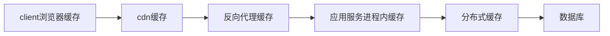
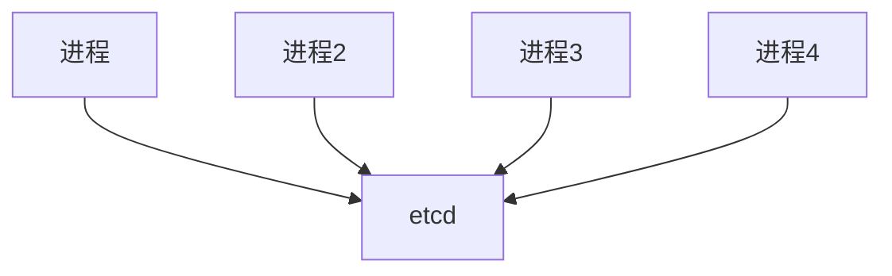
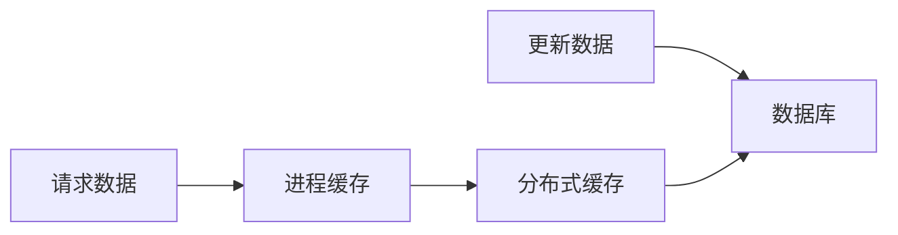

# 1. 缓存集群设计

## 1.1. 技术认知

### 1.1.1. 为什么要引入缓存

* 缓存，利用空间换时间的原理，提高系统的性能，解决数据库的压力问题。
* 缓存访问时间 = 命中率 x 缓存命中时间 + 未命中概率 x 数据库访问时间
  * 缓存命中率 = 命中次数 / 总访问次数

### 1.1.2. 缓存的优劣势

* 优势：更快的返回结果
* 劣势：缓存需要额外空间存储缓存结果，需要设计合理的淘汰策略

### 1.1.3. 应用场景

* 对于io相关的操作，如读写数据库，网络请求等
* 对于计算量非常大的计算，如大数据计算，机器学习，光照贴图等

### 1.1.4. 原理

* hash算法，将数据存储到缓存中。 dict[key] = value
* 淘汰策略：
  * TTL 超时淘汰
  * LRU 淘汰策略，将最近最少使用的数据淘汰
  * LFU 淘汰策略，将访问频率最少的数据淘汰（推荐，兼顾命中率和实现成本）
  * FIFO 淘汰策略，将最早放入缓存的数据淘汰

### 1.1.5. 其它

#### 1.1.5.1. 互联网技术的各级缓存设计



* 浏览器缓存：缓存一些静态资源，如html，css，js等，过期超时
* cdn缓存：访问距离自己较近的资源，如图片，视频，游戏包，游戏patch等
* 反向代理缓存：针对相同请求，缓存执行结果，减轻服务器压力
* 应用服务进程内缓存：向分布式缓存请求数据时，将请求的结果缓存在应用服务进程中，减少网络请求
* 分布式缓存：缓存数据库的结果，减少数据库查询次数

#### 1.1.5.2. 经典问题

* 缓存穿透
  * 缓存穿透是指请求的数据在缓存中没有，但是数据库中也没有
  * 布隆过滤器：如何设计和使用，是否可以更新？

* 缓存雪崩
  * 缓存雪崩是指缓存服务器在同一时间段内，大量数据过期
  * 在设置数据过期时间添加随机数

* 缓存击穿
  * 缓存击穿是指缓存服务器在同一时间段内，大量请求指向相同的数据
  * 采用多级缓存

* 一致性
  * 强一致性：基于事件同步
  * 中等一致性：基于版本号同步
  * 弱一致性：过期淘汰

## 1.2. 业务流程

## 1.3. 设计

### 1.3.1. 框架设计--基于版本号同步

#### 1.3.1.1. 框架图

  ```mermaid
  flowchart LR;
  subgraph 应用服务器
    进程
    进程内缓存
  end

  应用服务器
  查询-->进程-->进程内缓存--不命中-->分布式缓存--不命中-->数据库


  修改请求--更新-->数据库
  修改请求-->mq--清空-->分布式缓存

  ```

* 进程内缓存：超时+LRU
* 分布式缓存：redis

#### 1.3.1.2. 数据流图

* 调用一个函数，cache住这个函数调用的结果

  ```py
  @process_cache
  @distributed_cache
  async def QueryGangList(key1, key2, key3):
    return await async_db.CollectionName.find({"key1": key1, "key2": key2, "key3": key3})
  ```

  ```mermaid
  flowchart LR;
  
  函数参数对象-->进程内缓存-->分布式缓存-->数据库
  ```

  * 函数参数对象：tuple类型，(函数名,参数1,参数2,...)
  * 进程内缓存
    * dict[函数参数对象] = (value, version)
    * value为查询的结果
    * version表示查询结果的版本号
  * 分布式缓存
    * dict[函数参数对象bytes] = (value bytes, version)
    * 函数参数对象bytes：由函数参数对象序列化得到，用messagepack序列化得到
    * value bytes：由value序列化得到，用messagepack序列化得到
    > 分布式缓存，如redis，不直接支持python的类型，因此将其序列化后进行存储
  * 数据库
    * 数据库名：函数参数对象对应调用数据库函数，去发起查询
    * query：有参数得到
    * value对象：有document返回结果中得到

* 传入key，调用统一的查询函数，得到结果
  > 假设，数据存储在同一个表格中，只有key一个参数

  ```mermaid
  flowchart LR;
  
  key-->进程内缓存-->分布式缓存-->数据库
  ```

  * key为一个bytes或str
  * 进程内缓存
    * dict[key] = (value, version)
  * 分布式缓存
    * dict[key] = (value bytes, version)
  * 数据库
    * db[collection_name].find(query)
    * collection_name：采用默认的表格存储结果，表格格式是 key, value
    * query：{"key": key}
  
  ```mermaid
  sequenceDiagram;
  autonumber
  
  participant c as client
  participant pc as process_cache
  participant dc as distributed_cache
  participant db as database
  par miss
    c->>pc: key
    pc->>dc: key
    dc->>pc: miss
    pc->>db: key
    db->>pc: value
    pc->>dc: key, serialize(value), uuid_version
    dc->>pc: succeed
    pc->>c: value
  end
  par hit
    c->>pc: key
    pc->>c: value
    pc->>dc: check(key, uuid_version)
    par succeed
      dc->>pc: succeed
    end
    par failed
      dc->>pc: failed
      pc->>pc: delete cache of key
    end
  end
  ```

* 核心数据结构和算法
  * version采用uuid生成，因此，采用基于版本号的缓存，通常数据量要远大于uuid的长度
  * 进程内缓存
    * 不命中的情况下，去分布式缓存中查询结果
    * 在命中的情况下，返回结果。如果存在版本号，随机概率去分布式缓存中校验version，校验失败，则清空自己的缓存
    > 随机概率，基于时长的随机概率。小于1秒，概率为0，大于1秒，概率为1。都是可以定制的。
  * 分布式缓存，接收查询请求，将函数参数对象序列化，在分布式缓存中查询
    * 不命中，调用QueryGangList函数，返回的结果，序列化value bytes, 根据长度较大（大于uuid的n倍），则生成版本号，否则不生成。返回结果
    * 命中，获得value bytes，反序列化，返回value，如果有版本号也一起返回
  * 分布式缓存，接收校验version
    * key不能存在，则校验失败
    * key存在，版本号不一致，则校验失败
    * key存在，版本号一直，校验成功
  
### 1.3.2. 验证--基于版本号同步

#### 1.3.2.1. 业务流程验证

* 调用函数，可以得到结果，并且存在缓存
* 通过key，通用情况的统一调用，并且存在缓存
* 一致性强弱，看校验概率

#### 1.3.2.2. crup验证

* u：
* p：
  * 内存：采用lru+超时的淘汰策略，根据压测调参
  * cpu：redis具备分布式伸缩性

#### 1.3.2.3. 边界

* 不同的进程缓存，miss后，都发起数据库查询，并写数据库
  * 第一，利用一个进程去做排队写操作
  * 第二，用分布式锁，保证同时只有一个进程去写分布式缓存

* 同一个进程，有多个相同请求，确保指发起一次，其它的都await相同的结果

* 缓存雪崩（不同key）
  * 过期时间随机
  * 定期更新
  * 不过期

* 缓存击穿（不存在key）
  * 缓存非法值
  * 布隆过滤器：
    * 初始化的时候，需要加载所有的数据
    * 并且新增数据需要更新到布隆过滤器
    * 删除数据，无法更新布隆过滤器

* 缓存穿透（相同key）
  * 分布式锁读数据库

#### 1.3.2.4. 易用性

### 1.3.3. 框架设计--基于事件同步

#### 1.3.3.1. 架构图



#### 1.3.3.2. 数据流图


* 进程缓存：dict[key] = value

#### 1.3.3.3. 核心算法和实现

* 查询数据的时候，关注变更，并返回数据，缓存在进程中
* 数据过期，清除数据，并取消关注

### 1.3.4. 验证--基于事件同步

#### 1.3.4.1. 业务流程验证

* 强一致性

#### 1.3.4.2. crup验证

* 取决于etcd的性能

#### 1.3.4.3. 边界

* 同基于版本号一样处理

#### 1.3.4.4. 易用性

### 1.3.5. 框架设计--基于超时同步

#### 1.3.5.1. 架构图



#### 1.3.5.2. 数据流图

类比于版本号的缓存，但所有数据都不需要版本号

#### 1.3.5.3. 核心算法和实现

* 分布式缓存：需要设置过期时间
* 进程缓存：lru+超时的淘汰策略

### 1.3.6. 验证--基于超时同步

#### 1.3.6.1. 业务流程验证

#### 1.3.6.2. crup验证

#### 1.3.6.3. 边界

* 同基于版本号一样处理

#### 1.3.6.4. 易用性

## 1.4. 实现

* 类图
* 代码
* 重构

## 1.5. 测试

* 边界
* 压测

## 1.6. 结果

## 1.7. 总结

## 1.8. 文献

* [1] &#9733;&#9733;&#9733;&#9733;&#9734; [解析分布式系统的缓存设计](https://segmentfault.com/a/1190000041689802)
  * 比较全面，且有文献进一步深入

* [2] &#9733;&#9733;&#9733;&#9734;&#9734; [分布式系统 - 分布式缓存及方案实现](https://pdai.tech/md/arch/arch-z-cache.html)

* [3] [理解分布式系统中的缓存架构(上)](https://www.jianshu.com/p/73ce0ef820f9)

* [4] [Asyncio Coroutines Faster Than Threads!?](https://superfastpython.com/asyncio-coroutines-faster-than-threads/)
