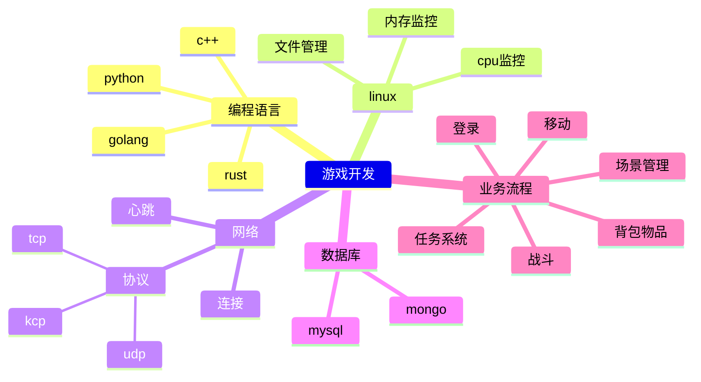
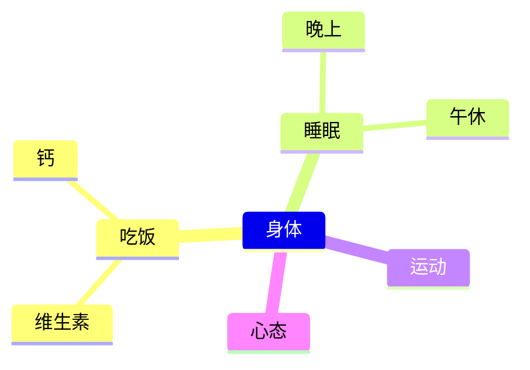

# 1. 领域

* 知识体系构建

## 1.1. 程序开发

[如何解决复杂问题.md](../../../系列/如何解决复杂问题/如何解决复杂问题.md)

## 1.2. 身体

## 1.3. 理财

## 1.4. 其它

### 1.4.1. 时间管理

* 少做事
* 心流
* 做完一件事，再做下一件
* 分解时间
  * 每天下班学习技术
  * 每天9点去健身房运动
  * 周末花时间处理家里的杂事

### 1.4.2. 心态调整

### 1.4.3. 习惯就是力量
