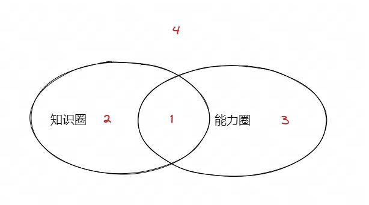
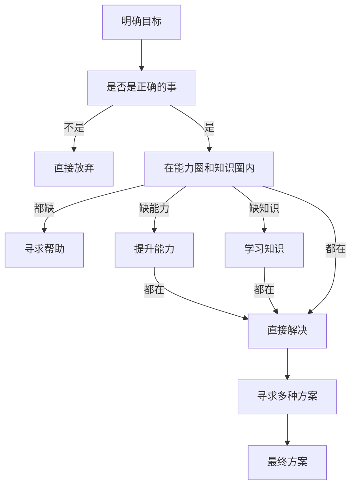
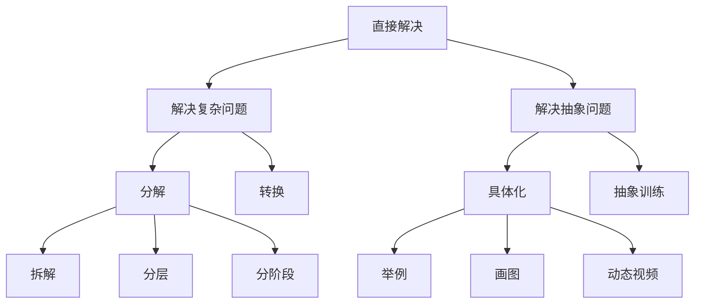

# 1. 目标--制作人

* 符合基本基本原则
  * 是否符合长期性：战略（站在未来做正确的事），策略（站在现在做正确的事），执行（站在现在正确的做事）
  * 是否能够完善元智慧

* 高标准
  * 项目经理：多快好省
  * 代码：crup

# 2. 业务分析--产品经理

* 梳理业务流程
  * 基于用户对象和应用场景梳理业务流程图
  * 业务流程图

* 方案框架式为业务流程服务，因此越熟悉业务流程，就能够设计出越好的框架

# 3. 调研--架构师

## 3.1. 查找资料

* 经典教材：找到基准线
* 高质量期刊：最新进展

用excel整理出所有找到的资料，包括年份信息、标题、要点、链接

> 相关资料，可以查看吴军的阅读与写作，还有科研过程中的方法论。参考链接[1]

## 3.2. 阅读资料

* 尽量阅读纸质资料（能够更专注、且更不易疲劳）

* 先阅读基准材料，然后按照年份相关性阅读

* 资料文章都有框架、模式，了解这些，可以快速知道要点

* 总结要点：记录，总结才知道自己是否读懂。要点包括：解决了什么问题，优劣，应用场景，数据结构和算法

> 技术变更的历史，可以更清楚技术的最大亮点，即解决了什么问题

## 3.3. 综述

* 将所有相关资料的要点整理，得到综述文章，包含不同方案的优劣和创新点

# 4. 方案设计--架构师

## 4.1. 方案

* 框架
  * 框架图：数据流图、核心模块，及其之间的交互
  > 数据流图、流程图、序列图、状态图、框架图，常用的软件设计图，抽象问题具体化，可以让我们更清楚的想问题。

* 核心算法：数据结构和算法（让自己想清楚算法细节）

## 4.2. 验证

* 业务流程验证：结合业务分析得到的业务流程图，嵌套到当前的框架，验证框架是否能够满足业务流程

* crup：
  * checkable（可查错）：log，assert，容错，异常；监控系统
  * readable（可读性）：封装、断舍离、清晰术语、typing
  * usable（可用性）：可用性公式、异常，开关；容灾
  * performance（高性能）：降频、降耗；伸缩降级熔断

* 边界分析：常规边界、对数器和暴力枚举、覆盖率
  > 底层框架，考虑全的边界，避免后期出问题查问题的时间。待到应用的时候，出问题，查底层问题，会非常麻烦

* 易用性：找得到、易输入，有反馈(及时清晰)
  
# 5. 代码实现--coder

## 5.1. 类图

从设计直接到代码，较为复杂，为了简化，增加类图设计，即设计-->类图-->代码，通过增加一个阶段简化复杂性
> 框架分析和业务流程分析，设计类图，然后在用业务流程验证接口和成员设计是否合理

* 先实现数据层接口
* 再核心业务流程写代码：思路清晰
* 小黄鸭运行流程

> 写代码的心态调整：慢

## 5.2. 整理代码

* 输入输出边界：assert或报错
* 必要的log：提供足够的log，方便查问题
* 异常：关键流程用异常包住，避免打断关键流程
* 较好的可读性：好代码的第一标准
  * 目录、文件、类、接口（是否可以删除不必要的接口、接口是否清晰、const和引用）

> 增加整理代码，避免在写代码的时候，分散注意力。
> 将原本写代码拆分成三个阶段，类图、写代码、整理代码，简化写代码的难度
> 除了，在写完代码进行整理代码，在其它时候，也可以做，整理代码也就是重构，时机：时时定时，当发现代码很丑的时候重构，定期进行一次重构
> 重构：先明确测试用例，小步修改，测试

## 5.3. 解决bug123

* 直接查问题，看报错，跟进报错，查问题

* 审视知识圈和能力圈

  * 知识圈(获取信息)：
    * 基础知识
    * log信息、coredump信息
    * 通过工具获取信息
    * 源码
      * 熟悉业务流程：试用、看视频、找人问
      * 运行
        * 打印log：关键流程和部分变量
        * viztrace：完整执行流程
        * debug：完整的堆栈和变量，通常比较局部
      * read
        * gpt协助
        * 跳读：只看关键路径
        * 带入变量，减少分支

  * 能力圈(科学的分析方法)：正向调试、逆向回溯

  > coding阶段的要求：恰当的assert、exception、error log。让引起错误原因的位置和显示错误的位置尽可能的接近，通常位置越远，查问题越难。

* 求助他人

> 保持平和的心态（这是解决问题的第一步，调整好心态）

## 5.4. 性能优化

### 5.4.1. profile定位

* 插桩
  * 自己统计耗时
* 函数hook
  * cProfile
* 采样
  * pyspy
  * postman

### 5.4.2. 具体优化

* 架构层：分布式架构（可伸缩、降级、熔断）、多线程多进程架构
* 算法层：
  * 降频：定时、事件、延迟执行
  * 降耗：
    * 基于o(n)的时间复杂度设计、基于执行流概率
    * 针对高频流程重点优化，保证平均时间复杂度，通常混合多种算法的优势[5]
    * 考虑cache等硬件命中率，尽量用连续内存实现
    * 空间换时间缓存结果
* 语言层：编译语言、解释语言。编译选项、pgo编译
  * 编译语言：-O3编译选项、pgo编译优化、lto优化、升级版本(python3.7->python3.11)
  * 脚本语言：jit(pypy)，转成编译语言(cython，或直接用c实现)
  * 写法优化：基于经验，借助检查工具来做优化
* 系统层：windows、linux
* 硬件层：选用好的硬件，将算法硬件化

# 6. 测试--qa

* 边界测试
  * 对数器[3]
  * 暴力枚举--model checker[2]
  * 覆盖率--python coverage

* 压测
  
* 上线测试

# 7. 易用性--ux

* 交互设计易用性，从使用这角度重新设计

# 8. 运营--运营

* 故障演练：可定位，能修复
* 指令

# 9. 成果--产品经理

* 做出来的东西是否达到产品级

# 10. 整理文档和技术复盘--项目经理

* 文档内容包括当前文档的各个条目
* 技术复盘
  * 每个阶段使用方法论调整，即更新到当前文档
  * 每个阶段的时间管理，即更新到当前文档

# 11. 总结

## 11.1. 零星点

* 解决复杂问题：将问题简化到能够解决的问题。简化的方法：
  * 分解
    * 拆解：横向分解，分解成不同的模块，可以不断细分
    * 分层：任何问题，都可以通过增加一层来解决
    * 分阶段：一个写代码的阶段，分解成三个阶段，每个阶段就会变得简单。在同一阶段处理太多事情，会让事情变得复杂，相反，会变得简单
  * 转换：找到等价信息，相关信息去将问题转换为我们能够解决的问题

* 解决抽象问题
  * 具体化（举例、画图、动态视频等）：画图（数据流图、类图、时序图、流程图、框架图、思维导图等）不同类型的图，可以辅助解决不同的问题，让我们把一些不清晰不明确的抽象的东西更具象化
  * 抽象问题可以训练和思考：抽象化的刻意练习，是抽离出常规的操作，加以应用训练。人们对于数字和它的各种运算，就是一种抽象化，并总结了一套常规操作，并让自己熟悉

* 技术认知深度
  * 调研：解决什么问题，优缺点，应用场景，原理
  * 使用：能够调用api，能够查问题，解决问题（概念，最佳实践，文档，源码）
  * 改造：熟悉整体架构，能够根据需求，迭代架构

* 向他人求帮助

* 做正确的事比正确做事更重要

* 思考多种方法，想到更好的方法事半功倍

* 明确目标：才能明确重点，做事的方法，做事的原则

* 架构：基于回调的逻辑和基于数据的逻辑

* 问题分类
  
  * 1 既在能力圈又在知识圈，是能轻松可以解决的问题
  * 2 在知识圈，不在能力圈：需要提升能力，思考欠缺什么样的能力，去补足
  * 3 在能力圈，不在知识圈：需要去学习缺乏的知识
  * 4 不在能力圈，也不在知识圈：通常需要需求他人帮助

## 11.2. 图

> 对于简单的问题：凭直觉，o(1)
> 对于复杂的问题：才需要走上面的流程，o(n)

# 12. 备忘

* 如何阅读源码
  * 核心流程中的核心代码

* 项目需求管理
  * 分清主次：有些就不是正确的事

## 12.1. 参考文献

* [1] [阅读与写作](https://github.com/xiewendan/game-dev-doc/blob/master/2023/%E9%98%85%E8%AF%BB%E4%B8%8E%E5%86%99%E4%BD%9C/%E9%98%85%E8%AF%BB%E4%B8%8E%E5%86%99%E4%BD%9C.md)

* [2] [model checker](https://www.bilibili.com/video/BV1ja411h7jt/?spm_id_from=333.788&vd_source=a2b56472ff2d43bd075e1fbe889ebd9a)

* [3] [对数器](https://www.bilibili.com/video/BV1mM4y1H7fz/?spm_id_from=333.337.search-card.all.click&vd_source=a2b56472ff2d43bd075e1fbe889ebd9a)

* [4] [viztrace](https://github.com/gaogaotiantian/viztracer)

* [5] c的qsort算法就是一种混合算法，充分利用不同方案的优势
  * 1、小于4：采用插入排序
  * 2、小于100M：采用归并排序
  * 3、大于100M：采用快排（当递归栈太深，采用代码展开后续的递归调用）

* [6] 解决问题123
  